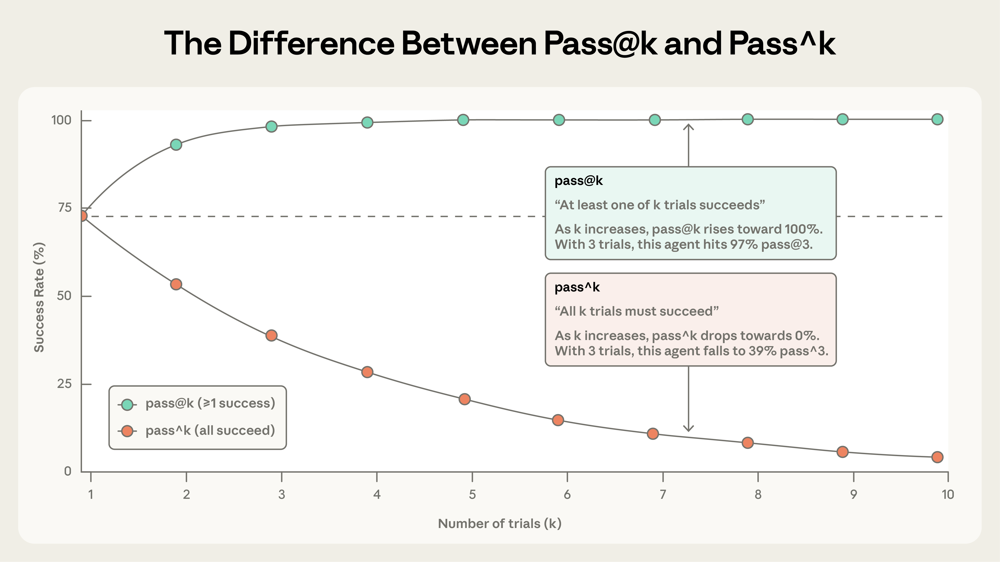
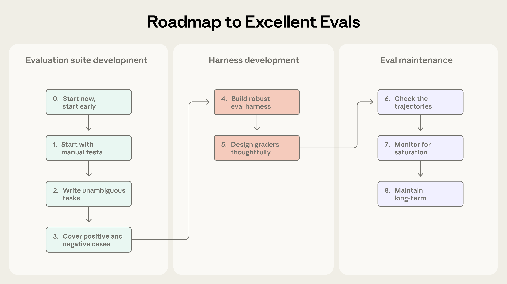

> **来源：** [Anthropic Engineering — Demystifying evals for AI agents](https://www.anthropic.com/engineering/demystifying-evals-for-ai-agents)

```markmap
# 揭秘 AI Agent 评估
## 评估概念
### 核心术语
- 任务 (Task) (包含输入和成功标准的测试用例)
- 试验 (Trial) (对任务的单次尝试)
- 评分器 (Grader) (评分逻辑；每个任务可有多个)
- 记录 / 轨迹 (Transcript / Trace) (试验的完整记录)
- 结果 (Outcome) (最终环境状态)
- 评估框架 (Evaluation harness) (端到端运行评估)
- Agent 脚手架 (Agent harness / Scaffold) (使模型以 Agent 身份运行)
- 评估套件 (Evaluation suite) (相关任务的集合)
### 评估类型
- 能力评估 (Capability evals)
  - 初始通过率低
  - 给团队一个“攀登的目标”
  - 接近 100% 后升级为回归套件
- 回归评估 (Regression evals)
  - 预期接近 100% 通过率
  - 捕捉变更后的倒退
## 评分器类型
### 基于代码 (Code-based)
- 字符串匹配 / 正则 / 模糊匹配
- 二元测试 (fail-to-pass, pass-to-pass)
- 静态分析 (lint, 类型, 安全)
- 结果验证
- 工具调用验证 (使用的工具, 参数)
- 记录分析 (轮数, token 使用量)
### 基于模型 (Model-based / LLM-as-judge)
- 基于评分标准的打分
- 自然语言断言
- 成对比较 (Pairwise comparison)
- 基于参考的评估
- 多裁判共识
### 人工 (Human)
- 专家 (SME) 审查
- 抽样检查
- A/B 测试
- 用于校准基于模型的评分器
### 评分方式
- 加权 (组合分数达到阈值)
- 二元 (所有评分器必须通过)
- 多组件任务的部分通过
## Agent 类型与评估
### 编程 Agent (Coding agents)
- 正确性单元测试
- 代码质量的记录评分
- 基准测试: SWE-bench Verified, Terminal-Bench
### 对话 Agent (Conversational agents)
- 最终状态结果检查
- 记录约束 (例如 < 10 轮)
- 语气和质量的 LLM 评分标准
- 模拟用户 (第二个 LLM 作为用户角色)
- 基准测试: τ-Bench, τ2-Bench
### 研究 Agent (Research agents)
- 依据性检查 (主张有来源支持)
- 覆盖率检查 (包含关键事实)
- 来源质量检查 (权威来源)
- LLM 评分标准 (由人类专家校准)
### 计算机操作 Agent (Computer use agents)
- 真实 / 沙箱环境
- URL 和页面状态检查
- 后端状态验证
- DOM 与截图的权衡
- 基准测试: WebArena, OSWorld
## 非确定性指标
### pass@k
- k 次尝试中 ≥1 次成功
- 随 k 增加而上升
- 适用于只需一次成功的情况
### pass^k
- 所有 k 次试验必须都成功
- 随 k 增加而下降
- 适用于一致性至关重要的情况
### 在 k=1 时它们相同；随 k 增长而分歧
## 路线图：从零到可信评估
### 收集任务
- 步骤 0: 尽早开始 (20–50 个来自真实失败的任务)
- 步骤 1: 转换手动测试和错误报告
- 步骤 2: 明确的任务 + 参考解决方案
- 步骤 3: 平衡的问题集 (应做和不应做的案例)
### 设计工具和评分器
- 步骤 4: 隔离环境，试验间无共享状态
- 步骤 5: 深思熟虑地设计评分器
  - 优先确定性，必要时用 LLM
  - 评分结果，而非路径
  - 设置部分通过
  - 用人类专家校准 LLM 裁判
### 长期维护
- 步骤 6: 定期阅读记录
- 步骤 7: 监控饱和度 (接近 100% → 增加更难的任务)
- 步骤 8: 共享所有权；评估驱动开发
## 评估 vs 其他方法
### 自动化评估
- 快速，可复现，无用户影响
- 每次提交都运行
### 生产监控
- 真实行为，捕捉分布漂移
- 被动 (问题先到达用户)
### A/B 测试
- 衡量真实用户结果
- 达到显著性较慢
### 用户反馈
- 发现未预料到的问题
- 稀疏且偏向严重问题
### 手动记录审查
- 建立对故障模式的直觉
- 不可扩展；审查员疲劳
### 系统性人类研究
- 金标准质量判断
- 昂贵且周期长
```

<mark>好的评估能帮助团队更自信地交付 AI Agent</mark>。缺少评估，团队很容易陷入被动循环——只有在生产环境中才能发现问题，而修复一个故障往往又引发新的故障。评估能让问题和行为变化在影响用户之前暴露出来，其价值会在 Agent 的整个生命周期中持续累积。

正如我们在 [构建高效 Agent](https://www.anthropic.com/engineering/building-effective-agents) 一文中所述，Agent 跨多轮运行：调用工具、修改状态、根据中间结果动态调整。也正是这些让 AI Agent 如此有用的特性——自主性、智能和灵活性——使得评估变得更加困难。

通过内部实践以及与 Agent 开发最前沿的客户合作，我们积累了为 Agent 设计更严格、更实用的评估方法。以下是在多种 Agent 架构和真实部署场景中验证有效的经验总结。

## 评估的结构

**评估**（"eval"）就是对 AI 系统的测试：给 AI 一个输入，然后用评分逻辑衡量输出是否达标。本文重点讨论的是**自动化评估**——即在开发阶段无需真实用户参与即可运行的评估。

**单轮评估** 很直接：一个提示词、一个响应、一套评分逻辑。早期 LLM 时代，单轮非 Agent 式评估是主流方法。随着 AI 能力的进步，**多轮评估** 变得越来越普遍。


在简单评估中，Agent 处理一个提示词，评分器检查输出是否符合预期。在更复杂的多轮评估中，编程 Agent 接收工具、任务（例如构建一个 MCP 服务器）和环境，执行“Agent 循环”（工具调用与推理），并将实现代码写入环境。随后通过单元测试验证 MCP 服务器是否正常工作。

**Agent 评估** 则更为复杂。Agent 在多轮交互中调用工具、修改环境状态并动态调整——这意味着错误可能逐步传播和放大。前沿模型还能找到超出静态评估预设范围的创造性解决方案。例如，Opus 4.5 在 [𝜏2-bench](https://github.com/sierra-research/tau2-bench) 的一个航班预订任务中，[发现](https://www.anthropic.com/news/claude-opus-4-5) 了政策中的漏洞并加以利用。虽然按照评估字面标准它“失败”了，但实际上为用户找到了更好的方案。

在构建 Agent 评估时，我们使用以下定义：

- **任务** (task)（也称为**问题**或**测试用例**）是一个具有定义好的输入和成功标准的单个测试。
- 对任务的每次尝试称为一次**试验** (trial)。因为模型输出在不同运行之间会有所变化，我们运行多次试验以产生更一致的结果。
- **评分器** (grader) 是对 Agent 表现的某些方面进行评分的逻辑。一个任务可以有多个评分器，每个评分器包含多个断言（有时称为**检查**）。
- **记录** (transcript)（也称为**轨迹** (trace) 或**路径** (trajectory)）是试验的完整记录，包括输出、工具调用、推理、中间结果以及任何其他交互。对于 Anthropic API，这是评估运行结束时的完整消息数组——包含所有对 API 的调用以及评估期间返回的所有响应。
- **结果** (outcome) 是试验结束时环境的最终状态。一个航班预订 Agent 可能在记录结束时说“您的航班已预订”，但实际结果是环境的 SQL 数据库中是否存在该预订。
- **评估框架** (evaluation harness) 是端到端运行评估的基础设施。它下发指令和工具，并发执行任务，记录所有步骤，对输出评分，并汇总结果。
- **Agent 脚手架** (agent harness / scaffold) 是让模型以 Agent 身份运行的系统：处理输入，编排工具调用，返回结果。当我们评估“一个 Agent”时，评估的是脚手架 *和* 模型协同工作的整体表现。例如，[Claude Code](https://claude.com/product/claude-code) 就是一个灵活的 Agent 脚手架，我们基于其核心能力通过 [Agent SDK](https://platform.claude.com/docs/en/agent-sdk/overview) 构建了[长时运行 Agent 框架](https://www.anthropic.com/engineering/effective-harnesses-for-long-running-agents)。
- **评估套件** (evaluation suite) 是为衡量特定能力或行为而设计的任务集合。套件中的任务通常围绕一个共同目标。例如，客户支持评估套件可能涵盖退款、取消订单和工单升级等场景。


Agent 评估的组件。

## 为什么要构建评估？

团队刚开始构建 Agent 时，靠手动测试、[自己试用](https://en.wikipedia.org/wiki/Eating_your_own_dog_food) (dogfooding) 和直觉的组合，往往就能走得很远。更严格的评估甚至显得像是拖慢发布节奏的额外负担。但过了早期原型阶段，一旦 Agent 上线并开始扩展规模，没有评估的开发方式就会开始失控。

失控的典型信号是：用户反馈 Agent 在改了什么之后变差了，而团队却处于“盲飞”状态——除了凭感觉试探，没有手段可以验证。缺乏评估时，调试完全是被动的：等投诉，手动复现，修 bug，然后祈祷别的地方不会出问题。团队既无法区分真正的退化和随机波动，也无法在发布前自动跑数百个场景来验证变更，更无法量化改进效果。

我们已经多次看到这种演变。例如，Claude Code 最初基于 Anthropic 员工和外部用户的反馈进行快速迭代。后来，我们添加了评估——首先是针对简洁性和文件编辑等狭窄领域，然后是针对过度设计等更复杂的行为。这些评估有助于识别问题，指导改进，并聚焦研究与产品的协作。结合生产监控、A/B 测试、用户研究等，评估提供了随着 Claude Code 扩展而持续改进的信号。

<mark>在 Agent 生命周期的任何阶段编写评估都是有用的。早期，评估迫使产品团队明确 Agent 成功的定义，而后期则有助于保持一致的质量标准。</mark>

[Descript](https://www.descript.com/) 的 Agent 帮助用户编辑视频，因此他们围绕编辑工作流的三个维度构建评估：别搞坏东西、做到我要求的、做得好。他们从手动评分逐步演进到由产品团队定义标准、定期与人工校准的 LLM 评分器，目前定期运行两套独立的评估套件，分别用于质量基准测试和回归测试。[Bolt](https://bolt.new/) AI 团队则是在 Agent 已拥有大量用户之后才开始建设评估体系。 3 个月内，他们建成了一套评估系统：运行 Agent 后用静态分析评分输出，用浏览器 Agent 端到端测试应用，并用 LLM 裁判评估指令遵循等行为。

有些团队在开发初期就建立评估；另一些则是到了规模化阶段，评估成为改进 Agent 的瓶颈时才补上。评估在开发早期尤其有价值——它能将预期行为显式地固化下来。两位工程师读同一份产品规范，对边缘情况的理解很可能不同。<mark>评估套件消除了这种歧义。</mark> 不管何时开始建设，评估都能加速开发。

<mark>评估还决定了你能多快采用新模型。</mark> 当更强大的模型问世时，没有评估的团队面临数周的测试，而拥有评估的竞争对手可以迅速确定模型的优势，调整提示词，并在几天内升级。

一旦有了评估，基线和回归测试就是顺带的事：延迟、Token 用量、单任务成本、错误率都可以在固定的任务集上持续跟踪。<mark>评估也可以成为产品团队和研究团队之间信息密度最高的沟通渠道，为研究人员定义可量化的优化目标。</mark> 显然，评估的价值远不止于跟踪回归和改进。只不过成本在前期显而易见，收益却在后期才逐步兑现，这种复利式的<mark>价值很容易被忽视</mark>。

## 如何评估 AI Agent

目前大规模部署的 Agent 主要有几类：编程 Agent、研究 Agent、计算机操作 Agent 和对话 Agent。它们可以应用于各行各业，且评估方法具有共通性——你不需要从零开始造轮子。下面各节介绍了针对不同 Agent 类型的成熟评估方法，你可以以此为起点，再根据自身领域进行扩展。

### Agent 的评分器类型

Agent 评估通常组合使用 <mark>三类评分器：基于代码的、基于模型的和人工的</mark>。每类评分器负责评估 Transcript 或最终结果的某个方面。选择合适的评分器组合是评估设计的关键环节。

**基于代码的评分器**

| **方法** | **优势** | **劣势** |
| :-- | --- | --- |
| • 字符串匹配检查（精确、正则、模糊等）<br>• 二元测试（fail-to-pass, pass-to-pass）<br>• 静态分析（lint, 类型, 安全）<br>• 结果验证<br>• 工具调用验证（使用的工具，参数）<br>• 记录分析（轮次，Token 使用量） | • 快速<br>• 廉价<br>• 客观<br>• 可复现<br>• 易于调试<br>• 验证特定条件 | • 对不完全匹配预期模式的有效变体脆弱<br>• <mark>缺乏细微差别</mark><br>• 评估某些更主观的任务时受限 |

**基于模型的评分器**

| **方法** | **优势** | **劣势** |
| --- | --- | --- |
| • 基于评分标准的打分<br>• 自然语言断言<br>• 成对比较<br>• 基于参考的评估<br>• 多裁判共识 | • 灵活<br>• 可扩展<br>• 捕捉细微差别<br>• 处理开放式任务<br>• 处理自由格式输出 | • 非确定性<br>• 比代码昂贵<br>• 需要与人工评分员校准以保证准确性 |

**人工评分器**

| **方法** | **优势** | **劣势** |
| --- | --- | --- |
| • 专家 (SME) 审查<br>• 众包判断<br>• 抽样检查<br>• A/B 测试<br>• 标注者间一致性 (Inter-annotator agreement) | • 金标准质量<br>• 匹配专家用户判断<br>• 用于校准基于模型的评分器 | • 昂贵<br>• 缓慢<br>• 规模化通常需要接触人类专家 |

对于每个任务，评分可以是加权的（组合评分必须达到阈值），二元的（所有评分器必须通过），或混合的。

### 能力评估与回归评估

**能力或“质量”评估** 问的是，“这个 Agent 擅长做什么？” 它们的初始通过率应该较低，针对 Agent 难以处理的任务，给团队一个“攀登的目标”。

**回归评估** 问的是：“Agent 是否仍然能胜任过去能做好的事？” 通过率预期应接近 100%。它们守护的是已有能力不退化——分数下降就意味着某处出了问题。团队在能力评估上持续提升的同时，也要同步跑回归评估，确保改进不会在其他地方引发副作用。

Agent 发布并优化后，<mark>高通过率的能力评估可以“毕业”成为回归套件</mark>，持续运行以捕捉任何漂移。曾经衡量“我们能做这个吗？”的任务随后衡量“我们还能可靠地做这个吗？”

### 评估编程 Agent

**编程 Agent** 编写、测试和调试代码，像人类开发者一样浏览代码库并运行命令。现代编程 Agent 的有效评估通常依赖于明确的任务、稳定的测试环境和对生成代码的全面测试。

确定性评分器对于编程 Agent 来说是很自然的，因为软件通常很容易评估：代码能运行吗？测试通过了吗？两个广泛使用的编程 Agent 基准测试，[SWE-bench Verified](https://www.swebench.com/SWE-bench/) 和 [Terminal-Bench](https://www.tbench.ai/)，都遵循这种方法。SWE-bench Verified 给 Agent 提供来自流行 Python 仓库的 GitHub issue，并通过运行测试套件来评分解决方案；只有在修复失败的测试而不破坏现有测试的情况下，解决方案才算通过。LLM 在这一评估上的得分在短短一年内从 40% 提高到了 >80%。Terminal-Bench 采取了不同的路径：它测试端到端的技术任务，例如从源码构建 Linux 内核或训练 ML 模型。

当你已经有了一组验证编程任务关键 *结果* 的通过/失败测试后，进一步对 *Transcript* 进行评分往往也很有价值。例如，基于启发式规则的代码质量检查能从“通过测试”之外的维度评估生成代码的质量，而配合清晰评分标准的模型评分器则可以评估 Agent 的工具调用方式、与用户的交互行为等。

**示例：编程 Agent 的理论评估**

考虑一个编程任务，Agent 必须修复身份验证绕过漏洞。如下面的 YAML 文件所示，可以使用评分器和指标来评估此 Agent。

```yaml
task:
  id: "fix-auth-bypass_1"
  desc: "Fix authentication bypass when password field is empty and ..."

graders:
  - type: deterministic_tests
    required: [test_empty_pw_rejected.py, test_null_pw_rejected.py]
  - type: llm_rubric
    rubric: prompts/code_quality.md
  - type: static_analysis
    commands: [ruff, mypy, bandit]
  - type: state_check
    expect:
      security_logs: {event_type: "auth_blocked"}
  - type: tool_calls
    required:
      - {tool: read_file, params: {path: "src/auth/*"}}
      - {tool: edit_file}
      - {tool: run_tests}

tracked_metrics:
  - type: transcript
    metrics:
      - n_turns
      - n_toolcalls
      - n_total_tokens
  - type: latency
    metrics:
      - time_to_first_token
      - output_tokens_per_sec
      - time_to_last_token
```

注意，此示例展示了全方位的可用评分器以作说明。在实践中，<mark>编程评估通常依赖于正确性验证的单元测试和评估整体代码质量的 LLM 评分标准</mark>，只有在需要时才添加额外的评分器和指标。

### 评估对话 Agent

**对话 Agent** 活跃在客服、销售、培训辅导等场景。与传统聊天机器人不同，它们维护上下文状态，调用工具，并在对话过程中采取实际行动。编程和研究 Agent 也涉及多轮交互，但对话 Agent 面临独特挑战：交互过程本身的质量也是评估对象。有效的对话 Agent 评估通常依赖可验证的最终状态结果以及同时衡量任务完成度和交互质量的评分标准。与大多数其他评估不同，它们往往需要第二个 LLM 来扮演用户。我们在 [对齐审计 Agent](https://alignment.anthropic.com/2025/automated-auditing/) 中也采用这种方式，通过持续的对抗性对话来压力测试模型。

对话 Agent 的成功是多维度的：工单是否解决了（状态检查）？是否在 <10 轮内完成（Transcript 约束）？语气是否得当（LLM 评分标准）？[𝜏-Bench](https://arxiv.org/abs/2406.12045) 及其后续版本 [τ2-Bench](https://arxiv.org/abs/2506.07982) 就是这类多维基准测试的代表。它们模拟零售客服和机票预订等场景下的多轮交互，由一个模型扮演用户角色，而 Agent 在真实场景中应对。

**示例：对话 Agent 的理论评估**

考虑一个支持任务，Agent 必须处理沮丧客户的退款。

```yaml
graders:
  - type: llm_rubric
    rubric: prompts/support_quality.md
    assertions:
      - "Agent showed empathy for customer's frustration"
      - "Resolution was clearly explained"
      - "Agent's response grounded in fetch_policy tool results"
  - type: state_check
    expect:
      tickets: {status: resolved}
      refunds: {status: processed}
  - type: tool_calls
    required:
      - {tool: verify_identity}
      - {tool: process_refund, params: {amount: "<=100"}}
      - {tool: send_confirmation}
  - type: transcript
    max_turns: 10

tracked_metrics:
  - type: transcript
    metrics:
      - n_turns
      - n_toolcalls
      - n_total_tokens
  - type: latency
    metrics:
      - time_to_first_token
      - output_tokens_per_sec
      - time_to_last_token
```

正如我们的编程 Agent 示例一样，此任务展示了多种评分器类型以作说明。在实践中，对话 Agent 评估通常使用基于模型的评分器来评估沟通质量和目标完成情况，因为许多任务——比如回答问题——可能有多个“正确”的解决方案。

### 评估研究 Agent

**研究 Agent** 收集、综合和分析信息，然后生成答案或报告等输出。与编程 Agent 通过单元测试提供二元通过/失败信号不同，研究质量只能相对于任务进行判断。什么算作“全面”、“来源充分”甚至“正确”取决于上下文：市场扫描、收购尽职调查和科学报告各自需要不同的标准。

研究评估面临独特的挑战：专家可能对综合报告是否全面存在分歧，随着参考内容的不断变化，基本事实也会发生变化，更长、更开放的输出为错误创造了更多空间。例如，[BrowseComp](http://arxiv.org/abs/2504.12516) 基准测试旨在测试 AI Agent 是否能在开放网络的大海捞针——这些问题被设计为易于验证但难以解决。

构建研究 Agent 评估的一种策略是结合评分器类型。依据性检查验证主张是否由检索到的来源支持，覆盖率检查定义好答案必须包含的关键事实，来源质量检查确认所咨询的来源是权威的，而不仅仅是检索到的第一个。对于具有客观正确答案的任务（“X 公司第三季度的收入是多少？”），精确匹配是有效的。LLM 可以标记不受支持的主张和覆盖率差距，也可以验证开放式综合报告的连贯性和完整性。

鉴于研究质量的主观性，基于 LLM 的评分标准应经常根据专家的人工判断进行校准，以有效地评估这些 Agent。

### 计算机操作 Agent

**计算机操作 Agent** 不通过 API 或代码执行，而是和人类一样通过截图、鼠标点击、键盘输入和滚动来操作软件。它们可以使用任何有图形界面 (GUI) 的应用——从设计工具到老旧的企业系统。评估这类 Agent 需要让它们在真实或沙箱环境中实际操作软件，然后验证是否达到了预期结果。例如，[WebArena](https://arxiv.org/abs/2307.13854) 测试浏览器任务，通过 URL 和页面状态检查验证导航是否正确，通过后端状态验证数据修改是否生效（确认订单是真的下了，而不只是看到了确认页面）。[OSWorld](https://os-world.github.io/) 进一步扩展到完整的操作系统控制，用评估脚本在任务完成后检查文件系统状态、应用配置、数据库内容和 UI 元素属性等。

浏览器 Agent 需要在 <mark>Token 效率</mark> 和延迟之间做权衡。基于 DOM 的交互执行速度快但 Token 开销大，基于截图的交互则较慢但 Token 更省。例如，让 Claude 总结维基百科内容时，提取 DOM 文本更高效；而在亚马逊上找笔记本电脑包时，截图更划算（因为提取整个 DOM 的 Token 消耗巨大）。<mark>在 Claude for Chrome 产品中，我们专门设计了评估来检验 Agent 是否能根据上下文选择正确的交互方式</mark>。这使我们得以更快、更准确地完成浏览器任务。

### 如何思考 Agent 评估中的非确定性

不管什么类型的 Agent，其行为在不同运行间都存在差异，这使得评估结果比表面看起来更难解读。每个任务有各自的成功率——可能这个任务 90%，那个任务 50%——这次跑过的任务下次可能就失败了。很多时候，我们真正想衡量的是 Agent 在某个任务上的成功 *频率*（即多次试验中的成功比例）。

两个指标有助于捕捉这种细微差别：

[**pass@k**](https://proceedings.neurips.cc/paper/2019/file/7298332f04ac004a0ca44cc69ecf6f6b-Paper.pdf) 衡量 Agent 在 *k* 次尝试中至少得到一个正确解决方案的可能性。随着 *k* 增加，pass@k 分数上升：更多的“射门”意味着至少一次成功的几率更高。pass@1 分数为 50% 意味着模型在其第一次尝试中成功完成了评估中的一半任务。在编程中，我们通常最感兴趣的是 Agent 在第一次尝试中找到解决方案——pass@1。在其他情况下，只要有一个方案行得通，提出多个解决方案也是有效的。

[**pass^k**](https://arxiv.org/abs/2406.12045) 衡量 *所有 k* 次试验都成功的概率。随着 *k* 增加，pass^k 下降，因为要求在更多试验中保持一致是一个更难跨越的门槛。如果你的 Agent 有 75% 的单次试验成功率，并且你运行 3 次试验，通过所有三次的概率是 (0.75)³ ≈ 42%。这个指标对于面向客户的 Agent 尤其重要，因为用户期望每次都能有可靠的行为。



pass@k 和 pass^k 随着试验次数的增加而分歧。在 k=1 时，它们是相同的（都等于单次试验成功率）。到 k=10 时，它们讲述了相反的故事：pass@k 接近 100% 而 pass^k 降至 0%。

这两个指标都很有用，使用哪一个取决于产品需求：pass@k 适用于一次成功很重要的工具，pass^k 适用于一致性至关重要的 Agent。

## 从零到一：通往优秀 Agent 评估的路线图

本节列出了我们将评估从无到有变为可信赖评估的实用、经过实地检验的建议。把这一部分看作是评估驱动的 Agent 开发路线图：尽早定义成功，清晰地衡量它，并持续迭代。

### 收集初始评估数据集的任务

**步骤 0. 尽早开始**

我们经常看到团队迟迟不建评估，因为觉得需要几百个任务才够。事实上，从真实失败中提炼 20-50 个简单任务就是很好的起点。毕竟在 Agent 开发早期，每次改动的影响通常清晰且显著，效应量大意味着小样本就够用了。更成熟的 Agent 可能需要更大规模、更高难度的评估来捕捉细微差异，但起步时用好 80/20 法则就够了。拖得越久，评估越难建。趁着早期产品需求还能自然地转化为测试用例赶紧动手——等系统上线后，你就只能费力地从线上行为中逆向推导成功标准了。

**步骤 1. 从你已经手动测试的内容开始**

从你在开发过程中运行的手动检查开始——你在每次发布前验证的行为以及最终用户尝试的常见任务。如果你已经在生产环境中，查看你的 bug 跟踪器和支持队列。将用户报告的失败转换为测试用例，确保你的套件反映实际使用情况；按用户影响进行优先级排序有助于你将精力投入到最重要的地方。

**步骤 2：编写明确的任务和参考解决方案**

把任务质量做好，比看起来难得多。一个好的任务，应该是两位领域专家独立评审后能得出一致的通过/失败结论。他们自己能完成这个任务吗？如果不能，说明任务需要打磨。任务规范中的歧义会变成指标中的噪声，这同样适用于模型评分器的标准：模糊的评分标准必然导致不一致的判断。

每个任务都应该能被正确遵循指令的 Agent 通过。这可能很微妙。例如，审计 Terminal-Bench 发现，如果任务要求 Agent 编写脚本但未指定文件路径，而测试假设脚本在特定路径，那么 Agent 可能会非因过错而失败。评分器检查的所有内容都应该在任务描述中清晰可见；Agent 不应因模糊的规格而失败。对于前沿模型，多次试验中的 0% 通过率（即 0% pass@100）通常是任务损坏的信号，而不是 Agent 无能的信号，这表明需要仔细检查你的任务规范和评分器。对于每个任务，创建一个参考解决方案是很有用的：一个已知可以通过所有评分器的工作输出。这证明了任务是可解的，并验证了评分器配置正确。

**步骤 3：构建平衡的问题集**

测试行为 *应该* 发生的情况和 *不应该* 发生的情况。片面的评估会造成片面的优化。例如，如果你只测试 Agent 是否在应该搜索时进行搜索，你可能会得到一个几乎对所有内容都进行搜索的 Agent。尽量避免 [类别不平衡](https://developers.google.com/machine-learning/crash-course/overfitting/imbalanced-datasets) 的评估。我们在为 [Claude.ai](http://claude.ai/redirect/website.v1.0a20217d-3021-4fb0-8259-5912b66c4656) 构建网络搜索评估时亲身体会到了这一点。挑战在于防止模型在不应该搜索时进行搜索，同时保留其在适当时候进行广泛研究的能力。团队构建了涵盖两个方向的评估：模型应该搜索的查询（如查询天气）和它应该根据已有知识回答的查询（如“谁创立了苹果公司？”）。在搜索不足（应该搜索时不搜索）或过度搜索（不应该搜索时搜索）之间取得恰当平衡是困难的，并且需要对提示词和评估进行多轮改进。随着更多示例问题的出现，我们将继续添加到评估中以提高覆盖率。

### 设计评估工具和评分器

**步骤 4：构建环境稳定的评估基础设施**

评估中的 Agent 应当与生产环境中的 Agent 行为基本一致，同时环境本身不能引入额外噪声。每次试验都应从干净的环境启动，做到彼此隔离。运行间残留的共享状态（遗留文件、缓存数据、资源耗尽）可能导致因基础设施不稳定而非 Agent 本身性能引发的关联性失败。共享状态还可能人为抬高分数：例如在一些内部评估中，我们发现 Claude 在部分任务上获得了不公平的优势——它检查了之前试验留下的 git 历史记录。如果多次独立试验因为环境中的同一个限制（如 CPU 内存不足）而失败，那这些试验实际上并不独立，评估结果也就无法可靠反映 Agent 的真实水平。

**步骤 5：深思熟虑地设计评分器**

如上所述，优秀的评估设计包括为 Agent 和任务选择最佳评分器。我们建议尽可能选择确定性评分器，在必要时或为了增加灵活性选择 LLM 评分器，并审慎使用人工评分器进行额外验证。

一种常见的冲动是检查 Agent 是否按特定步骤执行，比如是否按正确顺序调用了一系列工具。但我们发现这种做法过于僵硬，测试非常脆——因为 Agent 经常会找到评估设计者没有预见到的有效路径。为了避免不必要地惩罚创造性解法，通常应该评价 Agent 产出的 *结果*，而非它走过的 *路径*。

对于包含多个子步骤的任务，应设计部分计分机制。一个正确识别了问题、验证了客户身份但最终未能处理退款的客服 Agent，明显优于一上来就失败的 Agent。在评分结果中体现这种“成功程度的梯度”非常重要。

模型评分通常需要仔细迭代来验证准确性。LLM 裁判应该与人类专家紧密校准，以确信人类评分和模型评分之间的分歧很小。为了避免幻觉，给 LLM 一个退路，例如提供一条指令，当它没有足够信息时返回“未知”。创建清晰、结构化的评分标准来对任务的每个维度进行评分，然后使用隔离的 LLM 裁判对每个维度进行评分，而不是用一个裁判对所有维度进行评分，这也会有所帮助。一旦系统稳健，偶尔使用人工审查就足够了。

有些评估存在微妙的失效模式，即使 Agent 表现良好得分也很低，因为 Agent 由于评分错误、Agent 工具限制或歧义而未能完成任务。即使是成熟的团队也会错过这些问题。例如，[Opus 4.5 最初在 CORE-Bench 上得分 42%](https://x.com/sayashk/status/1996334941832089732?s=46&t=c5pEvnVdVbMkcR_rcCHplg)，直到一位 Anthropic 研究员发现了多个问题：僵化的评分因为期望“96.124991…”而惩罚“96.12”，模糊的任务规格，以及无法精确复现的随机任务。在修复错误并使用限制较少的支架后，Opus 4.5 的分数跃升至 95%。同样，[METR 发现](https://x.com/metr_evals/status/2001473506442375645?s=46) 他们的时间跨度基准测试中有几个配置错误的任务要求 Agent 优化到规定的分数阈值，但评分要求超过该阈值。这惩罚了像 Claude 这样遵循指令的模型，而忽略规定目标的模型获得了更好的分数。仔细复查任务和评分器有助于避免这些问题。

让你的评分器能够抵御绕过或黑客攻击。Agent 不应该能够轻易地“欺骗”评估。任务和评分器的设计应确保通过真正需要解决问题，而不是利用意外的漏洞。

### 长期维护和使用评估

**步骤 6：检查记录**

如果不通过多次试验阅读记录和评分，你就不会知道你的评分器是否工作良好。在 Anthropic，我们投资于查看评估记录的工具，并定期花时间阅读它们。当任务失败时，记录会告诉你 Agent 是犯了真正的错误，还是你的评分器拒绝了一个有效的解决方案。它通常还会揭示有关 Agent 和评估行为的关键细节。

失败即使发生也应该是公平的：很清楚 Agent 哪里做错了以及为什么。当分数没有攀升时，我们需要确信这是由于 Agent 的表现而不是评估的问题。阅读记录是你验证评估是否在衡量真正重要事项的方式，也是 Agent 开发的关键技能。

**步骤 7：监控能力 <mark>评估饱和度</mark>**

100% 的评估可以跟踪回归，但无法提供改进信号。**评估饱和** 发生在 Agent 通过所有可解决的任务时，没有留下改进空间。例如，SWE-Bench Verified 分数今年从 30% 开始，前沿模型现在正接近 >80% 的饱和度。随着评估接近饱和，进展也会放缓，因为只剩下最困难的任务。如果不注意，这会使结果具有欺骗性，因为巨大的能力提升显现为分数的微小增加。例如，代码审查初创公司 [Qodo](https://www.qodo.ai/) 最初对 Opus 4.5 并不印象深刻，因为他们的单次编程评估没有捕捉到在更长、更复杂任务上的收益。作为回应，他们开发了一个新的 Agent 评估框架，提供了更清晰的进展图景。

作为一个规则，在有人深入研究评估细节并阅读一些记录之前，我们不接受评估分数的表面价值。如果评分不公平，任务模糊，有效解决方案受到惩罚，或者工具限制了模型，则应修改评估。

**步骤 8：通过开放贡献和维护 <mark>保持评估套件的长期健康</mark>**

评估套件是一个需要持续维护的活文档，需要明确的负责人才能保持其有效性。

在 Anthropic，我们尝试了各种评估维护方法。证明最有效的是建立专门的评估团队来拥有核心基础设施，而领域专家和产品团队贡献大部分评估任务并自己运行评估。

对于 AI 产品团队而言，维护和迭代评估应该像维护单元测试一样成为日常。团队可能在某个 AI 功能上浪费数周——“早期试用没问题”，但它未能满足那些本可以通过精心设计的评估提前发现的隐含要求。定义评估任务本身就是对产品需求的一次压力测试：需求是否足够具体、可以开始动手了？

我们建议实行评估驱动开发：在 Agent 能够实现之前构建评估以定义计划的能力，然后迭代直到 Agent 表现良好。在内部，我们经常构建目前“足够好”但押注于模型几个月后能做什么的功能。初始通过率低的能力评估使这一点可见。当新模型发布时，运行套件会迅速揭示哪些押注得到了回报。

最接近产品需求和用户的人最有资格定义成功。鉴于目前的模型能力，产品经理、客户成功经理或销售人员可以使用 Claude Code 贡献评估任务作为 PR——让他们参与进来！或者更好的是，积极赋能他们。



创建有效评估的流程。

## 评估如何与其他方法配合以全面了解 Agent

自动化评估可以在不部署到生产环境或影响真实用户的情况下，针对数千个任务运行 Agent。但这只是了解 Agent 性能的众多方法之一。完整的图景包括生产监控、用户反馈、A/B 测试、手动记录审查和系统性人类评估。

| 方法 | 优点 | 缺点 |
| --- | --- | --- |
| **自动化评估**<br>*无需真实用户即可通过编程方式运行测试* | • 迭代更快<br>• 完全可复现<br>• 无用户影响<br>• 可在每次提交时运行<br>• 无需生产部署即可大规模测试场景 | • 需要前期投入构建<br>• 需要随着产品和模型的发展持续维护以避免漂移<br>• 如果不匹配真实使用模式，可能会产生错误的信心 |
| **生产监控**<br>*跟踪实时系统中的指标和错误* | • 反映大规模真实用户行为<br>• 捕捉合成评估遗漏的问题<br>• 提供 Agent 实际表现的第一手数据 | • 被动；问题在你察觉之前已到达用户<br>• 信号可能有噪声<br>• 需要投入可观测性建设<br>• 缺乏评分所需的标准答案 |
| **A/B 测试**<br>*用真实用户流量比较变体* | • 衡量实际用户结果（留存，任务完成）<br>• 控制混杂因素<br>• 可扩展且系统化 | • 慢；需要数天或数周才能达到显著性，并需要足够的流量<br>• 仅测试你部署的更改<br>• 如果无法彻底审查记录，很难了解指标变化的根本“原因” |
| **用户反馈**<br>*明确的信号，如点踩或错误报告* | • 发现你未预料到的问题<br>• 来自实际人类用户的真实案例<br>• 反馈通常与产品目标相关 | • 稀疏且自选<br>• 偏向严重问题<br>• 用户很少解释 *为什么* 失败<br>• 非自动化<br>• 主要依靠用户发现问题可能会产生负面用户影响 |
| **手动记录审查**<br>*人类阅读 Agent 对话* | • 建立对故障模式的直觉<br>• 捕捉自动检查错过的微妙质量问题<br>• 帮助校准“好”的样子并掌握细节 | • 耗时<br>• 不可扩展<br>• 覆盖不一致<br>• 审查员疲劳或不同审查员会影响信号质量<br>• 通常只给出定性信号，而不是明确的定量评分 |
| **系统性人类研究**<br>*训练有素的评分员对 Agent 输出进行结构化评分* | • 来自多位人类评分员的金标准质量判断<br>• 处理主观或模糊的任务<br>• 为改进基于模型的评分器提供信号 | • 相对昂贵且周期长<br>• 难以频繁运行<br>• 评分员间的分歧需要协调<br>• 复杂领域（法律、金融、医疗）需要人类专家进行研究 |

这些方法对应于 Agent 开发的不同阶段。自动化评估在发布前和 CI/CD 中特别有用，在每次 Agent 更改和模型升级时运行，作为防止质量问题的第一道防线。生产监控在发布后启动，以检测分布漂移和未预料到的现实世界故障。A/B 测试在你有足够的流量后验证重大更改。用户反馈和记录审查是持续的实践，用于填补空白：不断分类反馈，每周抽样阅读记录，并根据需要深入挖掘。保留系统性人类研究用于校准 LLM 评分器或评估以人类共识为参考标准的主观输出。


就像安全工程中的 <mark>[瑞士奶酪模型](https://en.wikipedia.org/wiki/Swiss_cheese_model) </mark>一样，没有任何单一的评估层能捕捉到每个问题。多种方法结合使用，漏过一层的故障会被另一层捕捉到。

最有效的团队结合了这些方法：用于快速迭代的自动化评估，用于基本事实的生产监控，以及用于校准的定期人工审查。

## 结论

没有评估的团队终将陷入被动循环——修一个 bug 引入另一个，分不清是真退化还是随机波动。尽早投入评估的团队则截然不同：故障转化为测试用例，测试用例防止退化，指标取代猜测，开发因此提速。评估给整个团队划出一条清晰的上升曲线，把“Agent 好像变差了”变成可以量化和行动的信号。价值会持续累积，但前提是你把评估当作核心组件来对待，而非事后补丁。

模式因 Agent 类型而异，但这里描述的基本原则是不变的。尽早开始，不要等待完美的套件。从你看到的失败中获取现实任务。定义明确、稳健的成功标准。深思熟虑地设计评分器并结合多种类型。确保问题对模型来说足够难。迭代评估以提高其信噪比。阅读记录！

AI Agent 评估仍是一个新生、快速发展的领域。随着 Agent 承担更长的任务，在多 Agent 系统中协作，并处理日益主观的工作，我们需要调整我们的技术。我们将随着了解的深入继续分享最佳实践。

由 Mikaela Grace、Jeremy Hadfield、Rodrigo Olivares 和 Jiri De Jonghe 撰写。感谢 David Hershey、Gian Segato、Mike Merrill、Alex Shaw、Nicholas Carlini、Ethan Dixon、Pedram Navid、Jake Eaton、Alyssa Baum、Lina Tawfik、Karen Zhou、Alexander Bricken、Sam Kennedy、Robert Ying 等人的贡献。同时特别感谢与我们在评估方面深度合作的客户和合作伙伴，包括 iGent、Cognition、Bolt、Sierra、Vals.ai、Macroscope、PromptLayer、Stripe、Shopify、Terminal Bench 团队等。本文凝聚了 Anthropic 内部多个团队在评估实践方面的集体经验。

## 附录：评估框架

目前已有多个开源和商业框架可帮助团队快速落地 Agent 评估，无需从零搭建基础设施。选择哪个取决于你的 Agent 类型、现有技术栈，以及你需要离线评估、生产可观测性还是两者兼顾。

[Harbor](https://harborframework.com/) 专为在容器化环境中运行 Agent 而设计，拥有跨云提供商大规模运行试验的基础设施，以及定义任务和评分器的标准化格式。像 Terminal-Bench 2.0 这样的流行基准测试通过 Harbor 注册表发布，使得运行已建立的基准测试以及自定义评估套件变得容易。

[Promptfoo](https://www.promptfoo.dev/) 是一个轻量级、灵活且开源的框架，专注于提示词测试的声明式 YAML 配置，断言类型从字符串匹配到 LLM 裁判评分标准。我们将 Promptfoo 的一个版本用于我们的许多产品评估。

[Braintrust](https://www.braintrust.dev/) 是一个将离线评估与生产可观测性和实验跟踪相结合的平台——对于需要在开发期间迭代并在生产中监控质量的团队非常有用。它的 `autoevals` 库包括针对事实性、相关性和其他常见维度的预构建评分器。

[LangSmith](https://docs.langchain.com/langsmith/evaluation) 提供跟踪、离线和在线评估以及数据集管理，并与 LangChain 生态系统紧密集成。[Langfuse](https://langfuse.com/) 为具有数据驻留要求的团队提供类似的功能，作为一个自托管的开源替代方案。

许多团队会混合使用多种工具，或者自研评估框架，甚至从简单的评估脚本起步。我们的经验是：框架固然能加速进展和规范流程，但评估的质量终究取决于你在其中运行的任务和评分器。通常最好的做法是快速挑一个契合工作流的框架，然后把主要精力投入到评估本身——持续打磨高质量的测试用例和评分器。
