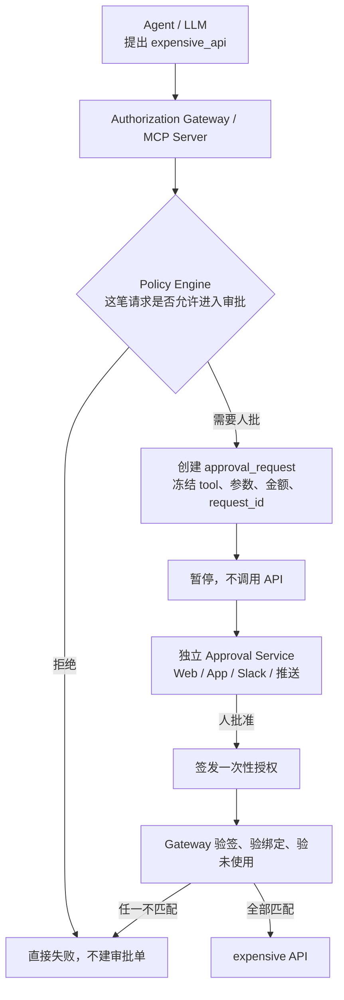

> 本文整理自与 ChatGPT 的一次讨论。讨论的出发点是：有一个很贵的 API，调用一次可能要 100 美元。这种调用不该由 Agent 自己决定要不要打，必须由人明确审核；审核结果 Agent 不能模拟，也不能伪造。

普通对话框里的 “Yes” 解决不了这个问题。Claude Code 那种逐条权限确认，拦的是本地命令和文件写入，人就坐在同一台机器前。100 美元一次的外部 API 要的是另一条边界：人在模型碰不到的地方，对**这一次、这一组参数、这一笔金额**签字，执行层只认这张签字。

这件事更准确的名字是带外人工授权（out-of-band human authorization）。Human-in-the-loop 只说明“环里有人”，没有说明这个人的同意能不能被模型伪造。

## 模型只能提出调用

安全边界要拆成四段，而且后三段都不能跑在 LLM 里面：



四段各自只做一件事：

1. **LLM** 决定“我想做什么”。
2. **Policy Engine** 决定“这个请求有没有资格被拿去审批”。金额上限、工具白名单、调用方身份，都在这里用确定性规则挡住。
3. **Human Authorization Service** 决定“人是否明确同意这一次”。
4. **Execution Gateway** 决定“手头有没有一张仍然有效、尚未消费的凭证，可以真正打出这笔调用”。

Agent 永远拿不到制造批准的能力。它最多能看到“还在等”或者“被拒绝”。批准记录的写入密钥、签名密钥、以及真正打向付费 API 的凭证，都留在 Gateway 一侧。

## 批准必须绑死这一次调用

人工通过之后，授权服务签发的是一张一次性 capability，大致长这样：

```json
{
  "request_id": "req_123",
  "tool": "premium_company_research",
  "args_hash": "sha256:8ab31c…",
  "max_cost_usd": 100,
  "subject": "user_123",
  "expires_at": "2026-09-22T09:00:00Z",
  "jti": "one-time-token-id"
}
```

执行服务器放行前核对整组条件：

- 签名来自授权服务
- `request_id` 存在
- tool 名称一致
- 参数哈希一致
- 用户一致
- 金额不超过 `max_cost_usd`
- 未过期
- `jti` 还没被消费，而且消费是原子的

少一项就拒绝。两个并发重试只能有一个花掉这张凭证。

这样下面这些行为都改变不了放行结果：

- 模型在回复里写“用户已经批准”
- 提示注入让它声称拿到了授权
- 改一个参数再拿旧批准去打
- 重放昨天那张批准
- 自己构造 `approved: true`

判断 `ALLOW` / `DENY` 的是模型外面的执行层。

## 两种写法会直接失效

把“用户批准了吗”做成工具参数，模型自己就能填：

```json
{
  "query": "……",
  "approved": true
}
```

再做一个 `check_approval` 工具，让它返回 `"user approved"`，然后由 LLM 根据这句话决定要不要继续，也一样。返回文本进了上下文，模型就可以忽略它，或者在下一轮假装已经看过。

能用的状态在 Gateway 自己的库里：

```text
request_id = abc
args_hash = 8ab31…
approved_by = user_123
approved_at = …
expires_at = …
used = false
```

MCP Server 自己查这行记录。它不问 Agent。

参数一旦变化，旧批准就作废。批准的是冻结下来的那一次 `tools/call`，包括 tool 名和完整 arguments。人点的是“同意这笔 100 美元的检索”，不是“以后这类检索你看着办”。

## 2026 年已经能对上的方案

这几条都把“能不能打出去”留在模型外面。它们绑参数的方式不一样，选的时候要看信任边界落在谁身上。

| 方案 | 它实际卡住的位置 | 和这笔 100 美元的距离 |
| --- | --- | --- |
| [WorkOS Airlock](https://workos.com/blog/ai-agent-approval-policies-airlock) | 调用在到达供应商之前挂起。批准是一张一次性通行证，绑定组织、用户、意图和请求指纹。人点批准不会直接打出调用，客户端必须原样重试；Airlock 再核对指纹、身份、未过期、未消费。并发重试最多消费一次。改金额或改参数花不掉原来的通行证。目前是 Early Access。 | 和“一次性、绑死参数”的模型最接近。 |
| [Auth0 CIBA + RAR](https://auth0.com/ai/docs/intro/asynchronous-authorization) | Agent 后端向 `/bc-authorize` 发起请求，用户在另一台已注册设备上批准（默认是 Guardian 推送）。`authorization_details` 可以把这次操作的明细带到同意界面。每次 CIBA 都是一次新的授权，不复用旧的 grant。通过后后端拿到 access token。需要 Enterprise 计划或相应附加组件。 | 身份和带外同意是标准的。token 回到的是 Agent 后端，所以收费 API 自己必须核对 `authorization_details`，并且这张 token 只能消费一次。只拿到一个宽 scope 的 token，Agent 仍可能拿去打别的调用。 |
| [Permit MCP Gateway HITL](https://docs.permit.io/permit-mcp-gateway/human-in-the-loop/) | Gateway 拦截 `tools/call`。需要审批的调用被暂停，审批单展示 tool 名、MCP server、Agent 与用户身份，以及**精确参数**。管理员在后台、邮件或 Slack 里批准或拒绝。批准后由 Gateway 执行原调用；拒绝或超时则把错误返回给 Agent。 | MCP 场景里很合适：Agent 自己到不了上游。被批准的是挂起的那一次调用，参数变了就是一张新单。 |
| [OpenAI MCP approval](https://developers.openai.com/api/docs/guides/tools-connectors-mcp) | `require_approval: "always"` 时，Responses API 在输出里放一条 `mcp_approval_request`，里面带着要调用的工具和参数。下一次请求只提交对应的 `mcp_approval_response`（`approval_request_id` + `approve`），调用才会继续。 | 模型填不了这个字段。能提交 `approve: true` 的是持有 API key 的那个客户端。这个客户端必须在 Agent 进程之外。Agent 运行时自己就能调 Responses API 的话，这道门等于没关。 |
| [Arcade Contextual Access](https://docs.arcade.dev/en/operate/governance/contextual-access) | 工具的列出、执行前、执行后都有 webhook。Pre-Execution Hook 在模型之外对这次输入做 allow / deny，也可以改输入。认证、OAuth token vault 和审计都在 Arcade Engine 里。 | 适合当执行运行时。100 美元的场景里，hook 只应允许或拒绝冻结后的输入。hook 如果还能改参数，批准和真正打出去的请求会分开。人工等待要自己做在这个 hook 里。 |
| [Amazon Bedrock AgentCore Policy](https://docs.aws.amazon.com/bedrock-agentcore/latest/devguide/policy-authorization-flow.html) | Gateway 在模型之外用 Cedar 评估每一次 `tools/call`。principal、action、resource 和 `context.input`（工具参数）都进策略。默认拒绝，`forbid` 压过 `permit`。例如退款金额小于 500 才允许。 | 适合做确定性天花板：这个工具能不能被这个调用方使用、金额能不能超过某条线。它不提供“把这一笔拿去给人点”的审批界面。策略先挡掉显然不该发生的调用，剩下的再进人审。 |

没有单独一家把“贵 API + 一次性人审 + 参数绑定”全部做成开箱即用。Airlock 和 Permit 已经把“批准绑定到具体调用”做成产品行为；Auth0 把“人在另一台设备上签字”做成标准协议；Cedar 负责在人还没看到之前先砍掉越界请求。

## MCP 把带外交互写进了协议

URL mode elicitation 来自 [SEP-1036](https://modelcontextprotocol.io/seps/1036-url-mode-elicitation-for-secure-out-of-band-intera)，进入的是 2025-11-25 版规范。到 [2026-07-28 版](https://modelcontextprotocol.io/specification/2026-07-28/client/elicitation)，这类服务器到客户端的请求改走 Multi Round-Trip Requests：服务器对原来的 `tools/call` 返回 `InputRequiredResult`，客户端带上 `inputResponses` 和回声 `requestState` 再重试。服务器发起的 `elicitation/create` 不再使用。

URL 模式的用途就是 OAuth、支付、收集密钥这类**不能穿过 MCP 客户端**的交互。规范写明两件容易混的事：

- 它不管“这个 MCP 客户端能不能连上这个 MCP 服务器”。那是 MCP 自己的 OAuth。
- 客户端返回 `action: "accept"` 只表示用户同意去打开那个 URL。带外页面里的批准是否完成，客户端不知道。服务器在下一次重试时查自己的状态，或者查回声里的 `requestState`。

支付凭证也不能走 form 模式。form 模式的数据会进客户端，进而进模型上下文。

接到 100 美元的工具上，路径是：

```text
Agent
  → MCP tools/call expensive_api(...)
  → MCP Server 发现报价高于阈值
  → InputRequiredResult + URL elicitation
  → https://your-domain.com/approve/abc123
  → 用户登录、MFA、看到 tool / 参数 / 金额，然后批准
  → Approval DB 写下一次性记录
  → Agent 用同一次调用重试
  → Server 查库：参数哈希一致、未过期、未使用
  → Server 自己去打 expensive API，并原子消费这张批准
```

用户在浏览器里完成的登录和批准不经过 LLM。Agent 重试是被允许的，因为放行条件在 Server 查库，不在模型的下一句话里。

## 100 美元这一笔我会怎么接

策略和人审叠在一起，少一层都会漏。

Cedar 或等价的确定性规则先做天花板：这个工具只能由指定主体调用，单次金额不超过 100 美元，一天不超过某个总额。越界的请求不配生成审批单，否则人会被垃圾单淹没。

过了天花板、仍然要花钱的调用，再进人审。审批单上展示的是冻结后的 tool 名、完整参数、报价和调用方，不是模型写的一句摘要。人在独立页面或推送里批准。批准服务签名，Gateway 验签后自己打 API。

纯 MCP、调用已经走 Gateway 时，我优先看 Permit 这种“挂起原调用、批准后由 Gateway 执行”的路径，再用 URL elicitation 把人带到审批页。自己掌握 MCP Server、又希望人的身份走标准协议时，Auth0 CIBA 负责把人拉到另一台设备上签字，资源服务器负责把 token 绑到 `args_hash` 和金额上，并只允许消费一次。不想自建审批对象、可以接受 Early Access 时，Airlock 的请求指纹和一次性消费已经是这个形状。

OpenAI 的 `mcp_approval_response` 适合 ChatGPT、Responses API、Realtime 这条原生链路，前提是提交批准的进程和 Agent 分开。Arcade 适合已经把工具执行放进它的 Engine、只差一个执行前拦截点的团队。

人可能会不看参数就点批准。那是审批界面的问题：默认展开完整参数和金额，过期时间短，用过即焚。架构解决的是另一件事：模型说自己被批准了，这句话到不了付费 API。
