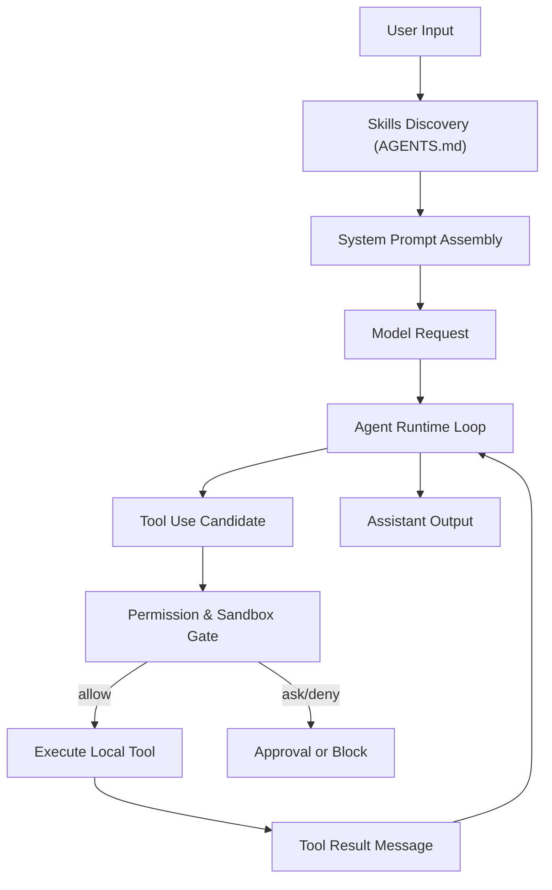

我一直对 Claude Code 这类命令行 Agent 工具很好奇：它到底怎么把"用户输入、系统约束、工具调用、权限控制"串成一个稳定的运行闭环？

这篇文章不是"产品体验帖"，而是一次工程向的拆解复盘：我用 Codex 从编译产物反推结构，把关键逻辑恢复成可读的 TypeScript 模块，并把重点放在三个我认为最有价值的核心：

- [Skills 发现与 System Prompt 注入]()
- [Subagent / Agent Runtime 的执行闭环]()
- [权限与沙箱约束链路]()

先声明边界：本文仅用于学习研究，不讨论未授权分发或商用复刻。

## 我的逆向路线：借助codex，先还原执行链路，再还原模块边界
在coding-agent超级高能的今天，逆向js已经是一个超级简单，甚至有点呆的事情，需要做的事情很少却非常高效，只需要简单三步：

1. 安装skill核武器：[superpowers](https://github.com/obra/superpowers/)
2. 简单的prompt：我不小心把源码弄丢了，只剩下编译后的文件 [cli.js](cli.js)，请你帮我还原成命名友好的TypeScript版本，并整理好清晰的目录结构，还原所有相关代码，不需要编译通过，只需要 1:1还原
3. codex会一句skill的要求，不断向我发问，澄清需求，我根据codex给出的选择题，来控制逆向的过程

**需要额外注意的是，因为这个源文件很大，codex在逆向的过程中可能会`故意`简化执行过程，这时候如果逆向的内容是我们关心的，需要指出他`偷懒`的工作，并要求他细化这部分的实现**

最终逆向还原后的项目结构如下（完整代码见 [GitHub 仓库](https://github.com/fatflowers/cc-source)）：

<details>
<summary>点击展开完整目录树</summary>

```text
cc_source
|-- AGENTS.md
|-- README.md
|-- bin
|   `-- claude.ts
|-- cli.js
|-- docs
|   |-- deps
|   |   |-- node-builtins.txt
|   |   `-- third-party.txt
|   |-- plans
|   |   |-- 2026-02-03-claude-cli-restore-design.md
|   |   |-- 2026-02-03-claude-cli-restore.md
|   |   |-- 2026-02-04-fs-highlevel-design.md
|   |   |-- 2026-02-04-fs-highlevel-implementation.md
|   |   |-- 2026-02-04-mcp-design.md
|   |   |-- 2026-02-04-mcp-implementation.md
|   |   |-- 2026-02-04-tool-pairing-design.md
|   |   `-- 2026-02-04-tool-pairing-implementation.md
|   `-- porting
|       `-- legacy-map.md
|-- package.json
|-- scripts
|   `-- extract-deps.mjs
|-- src
|   |-- cli
|   |   |-- definition.ts
|   |   |-- main.ts
|   |   |-- route.ts
|   |   `-- run.ts
|   |-- commands
|   |   |-- doctor.ts
|   |   |-- install.ts
|   |   |-- mcp.ts
|   |   |-- plugin.ts
|   |   |-- setup-token.ts
|   |   `-- update.ts
|   |-- core
|   |   |-- agent
|   |   |   |-- inProcessRunner.ts
|   |   |   |-- index.ts
|   |   |   |-- mailbox.ts
|   |   |   |-- manager.ts
|   |   |   |-- options.ts
|   |   |   |-- protocol.ts
|   |   |   |-- run.ts
|   |   |   |-- runtime.ts
|   |   |   `-- types.ts
|   |   |-- context.ts
|   |   |-- conversation
|   |   |   |-- cache.ts
|   |   |   |-- index.ts
|   |   |   |-- messages.ts
|   |   |   |-- toolPairing.ts
|   |   |   `-- types.ts
|   |   |-- fs
|   |   |   |-- index.ts
|   |   |   |-- limits.ts
|   |   |   |-- ops.ts
|   |   |   |-- readers.ts
|   |   |   `-- types.ts
|   |   |-- mcp
|   |   |   |-- bridgeClient.ts
|   |   |   |-- client.ts
|   |   |   |-- config.ts
|   |   |   |-- dispatch.ts
|   |   |   |-- index.ts
|   |   |   |-- poolClient.ts
|   |   |   |-- socketClient.ts
|   |   |   `-- types.ts
|   |   |-- model
|   |   |   |-- attribution.ts
|   |   |   |-- betas.ts
|   |   |   |-- client.ts
|   |   |   |-- constants.ts
|   |   |   |-- index.ts
|   |   |   |-- metadata.ts
|   |   |   |-- request.ts
|   |   |   |-- systemPrompt.ts
|   |   |   |-- toolRunner.ts
|   |   |   |-- types.ts
|   |   |   `-- validateModel.ts
|   |   |-- permissions
|   |   |   |-- context.ts
|   |   |   |-- engine.ts
|   |   |   |-- index.ts
|   |   |   |-- rules.ts
|   |   |   `-- types.ts
|   |   |-- plugins
|   |   |   |-- index.ts
|   |   |   |-- loader.ts
|   |   |   |-- runtime.ts
|   |   |   `-- types.ts
|   |   |-- sandbox
|   |   |   |-- config.ts
|   |   |   |-- index.ts
|   |   |   |-- policy.ts
|   |   |   `-- types.ts
|   |   |-- skills
|   |   |   |-- agentsFile.ts
|   |   |   |-- agentsParser.ts
|   |   |   |-- discovery.ts
|   |   |   |-- executor.ts
|   |   |   |-- index.ts
|   |   |   |-- loader.ts
|   |   |   |-- parser.ts
|   |   |   |-- prompt.ts
|   |   |   |-- runtime.ts
|   |   |   `-- types.ts
|   |   |-- telemetry
|   |   |   |-- client.ts
|   |   |   `-- index.ts
|   |   |-- tools
|   |   |   |-- bash.ts
|   |   |   |-- copy.ts
|   |   |   |-- edit.ts
|   |   |   |-- glob.ts
|   |   |   |-- grep.ts
|   |   |   |-- index.ts
|   |   |   |-- lruCache.ts
|   |   |   |-- ls.ts
|   |   |   |-- mkdir.ts
|   |   |   |-- move.ts
|   |   |   |-- notebookEdit.ts
|   |   |   |-- read.ts
|   |   |   |-- rm.ts
|   |   |   |-- skill.ts
|   |   |   |-- stat.ts
|   |   |   |-- structuredOutput.ts
|   |   |   |-- tree.ts
|   |   |   |-- types.ts
|   |   |   |-- webFetch.ts
|   |   |   |-- webSearch.ts
|   |   |   `-- write.ts
|   |   `-- web
|   |-- io
|   |   `-- logger.ts
|   `-- legacy
|       `-- bridge.ts
|-- tests
|   |-- fixtures
|   |   |-- help.txt
|   |   `-- version.txt
|   `-- smoke
|       |-- cli-context.test.mjs
|       |-- cli-deps.test.mjs
|       |-- cli-help.test.mjs
|       `-- cli-version.test.mjs
`-- tsconfig.json

31 directories, 135 files
```

</details>

以下是部分逆向过程的摘录

### [01] 2026-02-03T15:16:45.792Z
**assistant**

```text
（无上文 assistant 消息）
```

**user**
```text
[$writing-plans](.agents/skills/writing-plans/SKILL.md)  我不小心把源码弄丢了，只剩下编译后的文件 [cli.js](cli.js)

请你帮我还原成命名友好的TypeScript版本，并整理好清晰的目录结构，还原所有相关代码，不需要编译通过，只需要 1:1还原
```

### [02] 2026-02-03T15:18:13.901Z
**assistant**
```text
我在使用 **brainstorming** 技能来先澄清需求并形成设计方向，之后会用 **writing-plans** 产出实施计划。

我检查了当前项目状态：目录下只有 `cli.js` 和 `AGENTS.md`（没有 `.git` 仓库）。

**问题（单选）：**  
你要还原的范围是  
1. 只还原你自己编写的源码结构，第三方库改为依赖安装（如 `package.json` 引入）；  
2. 把 `cli.js` 里打包进来的所有第三方库也都拆回 TypeScript 源码，一并还原。
```

**user**
```text
1
```

### [03] 2026-02-03T15:18:41.521Z
**assistant**

```text
我在使用 **brainstorming** 技能来先澄清需求并形成设计方向。

**问题（单选）：** 你希望的还原输出结构是  
1. 标准 CLI 包结构（推荐）：`src/`、`bin/`、`package.json`、`tsconfig.json`  
2. 只生成 TypeScript 源码树（`src/`），不包含任何配置文件  
3. 你有现成的项目结构/规范，需要我按它来
```

**user**
```text
1
```

### [05] 2026-02-03T15:20:18.302Z
**assistant**
```text
我在使用 **brainstorming** 技能来先澄清需求并形成设计方向。

**问题：** 你还记得这个 CLI 的用途和核心命令/参数吗？请尽量给出示例（例如 `cli <command> [options]` 的用法或输出）。
```

**user**
```text
你可以在命令行中 执行 claude --help，这是用途和核心命令/参数
```

### [09] 2026-02-03T15:23:14.628Z
**assistant**
```text
我在使用 **brainstorming** 技能来先澄清需求并形成设计方向。

**可选方案与取舍（推荐在前）：**  
1. **混合还原（推荐）**：先把 `cli.js` 做 AST 解析与结构化分段，识别外部依赖并转成 `package.json`，把我们自己的逻辑拆成清晰的 TS 模块；对难以还原的复杂段保留为 `legacy/*.ts`，但变量命名友好、接口清晰。优点是成本可控、还原度高；缺点是部分内部实现仍"相对忠实"而非"优雅重构"。  
2. **深度语义还原**：尝试从 bundle 中重构完整模块边界、类型与注释，尽量消除 `legacy` 代码。优点是可维护性高；缺点是时间成本极高，且无源码情况下准确性风险大。  
3. **浅层剥离**：只还原 CLI 入口和命令定义，其余逻辑保留在单个大文件中但改成 TS。优点是最快；缺点是目录结构不清晰，违背"命名友好"的目标。

---

**设计草案（第 1 部分 / 架构与目录结构，约 220 字）**  
目标是生成标准 ESM CLI 包结构，并保持 `claude --help` 文案和行为一致，同时将第三方库改为依赖。目录建议：`bin/claude.ts` 作为入口（带 `#!/usr/bin/env node`），`src/cli/` 放 CLI 配置与命令注册，`src/commands/` 按子命令拆分（`doctor`, `install`, `mcp`, `plugin`, `setup-token`, `update`），`src/core/` 放运行时核心（会话管理、权限/工具策略、配置加载、模型选择、打印模式），`src/io/` 放输出/日志/流处理，`src/config/` 放 settings 合并与来源解析。第三方依赖通过静态扫描识别（例如 `commander` 或 `yargs`）、按需加入 `package.json`，并在 TS 中直接使用，确保 `--help` 的格式可复现。对于 bundle 中难以拆分的内部逻辑，以 `src/legacy/` 保留（模块名和函数名做语义化命名），并用清晰的入口函数把它们嵌回主流程，保证 1:1 行为为第一优先级。

这一方向目前看起来对吗？
```

**user**
```text
可以，继续
```

### [10] 2026-02-03T15:23:38.558Z
**assistant**
```text
我在使用 **brainstorming** 技能来先澄清需求并形成设计方向。

**设计草案（第 2 部分 / 数据流与还原策略，约 230 字）**  
数据流按 CLI 生命周期拆分：入口 `bin/claude.ts` 解析 argv → `src/cli/parseArgs.ts` 产出结构化参数 → `src/cli/run.ts` 根据 `--print`/交互模式/子命令路由到 `src/commands/*`。共享上下文（配置、权限、工具集、日志级别、session id）通过 `CliContext` 传递，避免隐式全局。为了 1:1 行为，我们用 `cli.js --help` 输出做基线，把每个 option 的旗标、描述、默认值映射回 Commander（或 Yargs）定义；若 help 顺序或排版无法完全复刻，就用自定义 help formatter 以匹配文本。  
还原策略分两层：  
1. **静态识别外部依赖**：从 bundle 中提取 `require("x")` / `import "x"` 字符串与已知内置模块，推断第三方依赖写入 `package.json`，并在 TS 文件中用真实导入替代。  
2. **模块拆分与命名**：按功能块把 bundle 切成 `core`、`io`、`commands`、`config`，对难以完全理解的部分保留在 `legacy/`，但对外暴露清晰函数名和接口类型，内部用 `unknown`/`any` 做过渡，确保结构"命名友好"而行为忠实。  

这一部分看起来对吗？
```

**user**
```text
可以，继续
```

### [11] 2026-02-03T15:23:53.365Z
**assistant**
```text
我在使用 **brainstorming** 技能来先澄清需求并形成设计方向。

**设计草案（第 3 部分 / 错误处理、测试与交付，约 210 字）**  
错误处理保持 CLI 语义：`--print` 模式下应尽量结构化输出（text/json/stream-json），交互模式下使用友好错误消息与非 0 退出码。`EPIPE` 等写入错误会被捕获并静默退出（bundle 中已有相关逻辑）。日志与 debug 选项（`--debug`, `--debug-file`, `--verbose`）统一经过 `src/io/logger.ts` 控制等级与输出目标。  
测试只做"行为快照"级别（即便不要求编译通过，也提供测试骨架），以 `cli.js --help` 和 `--version` 输出比对为核心，附带少量选项解析测试。  
最终交付：在根目录生成标准 ESM CLI 工程结构（含 `package.json`, `tsconfig.json`, `src/*`, `bin/*`），并保留原 `cli.js` 不动作为对照。对 bundle 中无法语义化的部分放在 `src/legacy/*`，但仍拆到合理模块，保持命名友好。  

如果认可设计，我接下来会**用 writing-plans 生成详细实施计划**，写到 `docs/plans/2026-02-03-claude-cli-restore.md`。可以继续吗？
```

**user**
```text
可以，继续
```

### [15] 2026-02-03T15:40:01.509Z
**assistant**
```text
Skipped tests as requested and continued with the remaining tasks. Below is the current source code content for the new/updated files.

**File:** `bin/claude.ts`
```ts
#!/usr/bin/env node
import { main } from "../src/cli/main.js";

main().catch((err) => {
  console.error(err);
  process.exit(1);
});
```

**File:** `package.json`
```json
{
  "name": "claude-cli-restored",
  "private": true,
  // ...
}
```

**File:** `tsconfig.json`
```json
{
  "compilerOptions": {
    "target": "ES2022",
    "module": "NodeNext",
  // ...
}
```

**File:** `src/cli/definition.ts`
```ts
import { Command } from "commander";
...
```

**File:** `src/cli/run.ts`

...


If you want me to dump additional files (fixtures/tests or any other folder), tell me which paths.

**user**

```text
缺少最关键的 模型调用，tool 使用的代码，请帮我找回来
```

### [16] 2026-02-03T15:46:41.522Z
**assistant**
```text
我在使用 **brainstorming** 技能来先澄清需求并形成设计方向。

我已经在 `cli.js` 里定位到关键实现片段：  
- 模型调用函数（`iM1`，调用 `client.beta.messages.create`）  
- 工具执行与工具结果生成（`BR5` + `ToolRunner` 类）  
- 相关系统提示与归因头构造（`Z76`/`f76`/`RAA`/`vfY`）

**问题（单选）：** 你希望我  
1. 先把这些逻辑恢复成独立 TS 模块（`src/core/model/*`），暂不接入 `runCli`（推荐，便于审阅）  
2. 直接把它们接入当前 CLI 入口流程（需要更多现有流程的上下文）  
3. 两者都做（模块 + 接入）
```

**user**
```text
还需要具体的tool实现的代码
```

## 当前恢复后的总览执行图



从这张图可以做出一些对逆向结果的核心判断：

- Skills 不只是"附加文案"，而是系统约束输入层，会添加到System Prompt中
- Runtime 本质是"模型-工具-消息"的状态机循环，也就是ReAct理论
- 权限系统必须在工具执行前做硬门控，通过Human-In-The-Loop来分摊责任
- 子代理机制不应污染单代理核心循环，最好通过 mailbox/manager 抽离

## 这次逆向里最实用的经验

- 模型已经足够强，将核心逆向流程的设计交给模型，人通过决策辅助模型
- 模型会`偷懒`，人矫正模型的工作过程得到自己想要的结果
- 整体上是先恢复骨干，再补齐细节
