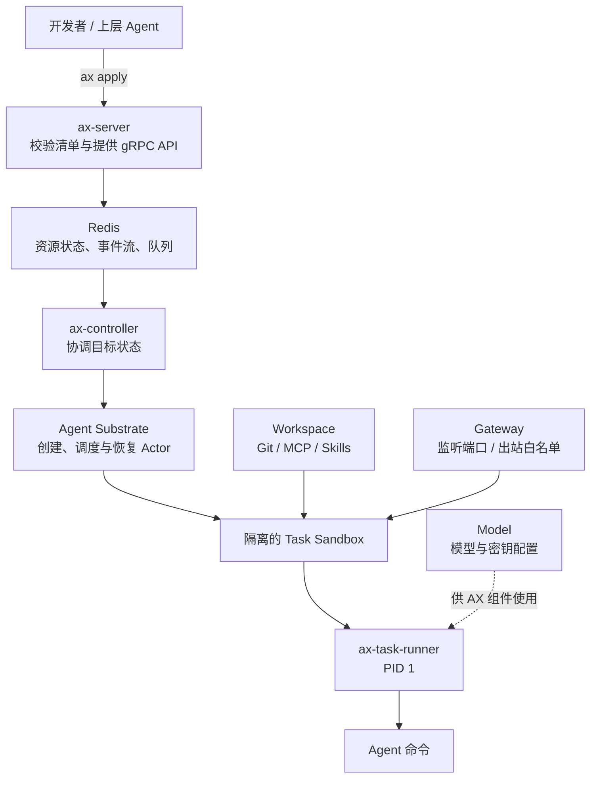

> 本文仅用于学习和了解新项目，正文由 AI 撰写。

写一个能调用大模型和工具的 Agent 并不难，难的是让一万个 Agent 安全、稳定、便宜地跑起来。

本地演示里，Agent 往往只是一个 Python 或 TypeScript 进程：读提示词、调用模型、执行工具、输出结果。但进入生产环境后，问题很快会变成：代码应该在哪运行？它能访问哪些仓库和网站？闲置半小时还要不要占着一整台机器？进程被中断后能不能接着工作？怎样同时管理成千上万个执行中的 Agent？

[Google AX](https://github.com/google/ax) 想解决的就是这一层问题。它把自己定义为一个面向 Agent 工作负载的声明式编排器：你提交一份类似 Kubernetes 清单的 YAML，AX 负责准备工作区、建立网络边界、启动隔离环境，并管理任务的暂停、恢复和销毁。

它不是教 Agent 如何推理的框架，也不是封装模型 API 的 SDK。更准确地说，**Agent 框架负责“大脑”，AX 负责“工位、门禁和运行制度”**。

> 本文基于 2026 年 9 月 22 日的 AX `main` 分支与[项目官网](https://agentexecutor.io/)撰写。项目接口仍是 `v1alpha1`，官方明确提醒稳定版之前可能有重大变更。

## 为什么 Agent 不是普通微服务

微服务通常持续监听请求，资源需求相对稳定；批处理任务则从头运行到尾，结束后退出。Agent 同时不太像这两者。

一个 Agent 可能先高强度运行几分钟，然后等待模型、外部工具或人工审批；它会修改文件、积累上下文和中间结果；它可能递归拆出子任务；它还会执行模型生成的代码，并访问网络。换句话说，Agent 往往同时具有四个特点：

- **有状态**：工作区、进程和中间产物都可能影响下一步。
- **突发式计算**：真正消耗 CPU 的时间不连续，大量时间在等待。
- **长生命周期**：一次任务可能跨越数小时甚至数天。
- **高风险权限**：它可能执行不可信代码、读取凭证、访问外部服务并持续花钱。

如果每个等待中的 Agent 都独占一个容器或虚拟机，资源利用率会很差；如果所有 Agent 又都挤在一个进程里，隔离、故障恢复和权限控制会变得非常困难。

AX 的判断是：Agent 需要一种新的调度单位。它应该像容器一样可以隔离，像进程一样轻量，还能在等待时保存状态并暂停。

## 四个原语：工单、工位、门禁和模型配置

AX 没有试图描述 Agent 的每一次思考，而是只提供四个基础资源。

| AX 资源 | 可以把它理解成 | 主要职责 |
| --- | --- | --- |
| `Task` | 一张工单 | 定义镜像、命令、CPU/内存、环境变量，以及要绑定的工作区和网关 |
| `Workspace` | 准备好的工位 | 放入 Git 仓库、MCP Server、技能和其他执行所需材料 |
| `Gateway` | 门禁与网络出口 | 声明任务对外暴露的端口，以及允许访问的外部主机和端口 |
| `Model` | 集中管理的模型配置 | 记录提供商、模型 ID、生成参数和 Kubernetes Secret 引用 |

这四个对象都使用 `ax.io/v1alpha1` API，并且可以写在同一个多文档 YAML 文件里。一个简化的任务大致长这样：

```yaml
apiVersion: ax.io/v1alpha1
kind: Workspace
metadata:
  name: code-review
spec:
  git:
    - name: app
      repo: https://github.com/example/app.git
      branch: main
  skills:
    path: /.agents/skills
---
apiVersion: ax.io/v1alpha1
kind: Gateway
metadata:
  name: restricted-egress
spec:
  egress:
    allowlist:
      hosts:
        - host: api.github.com
          port: 443
---
apiVersion: ax.io/v1alpha1
kind: Task
metadata:
  name: review-123
spec:
  image: ghcr.io/example/reviewer:latest
  command: ["python", "review.py"]
  resources:
    limits:
      cpu: "2"
      memory: "4Gi"
  workspaces:
    - name: code-review
      path: /workspace
  gateway:
    name: restricted-egress
```

然后使用类似 `kubectl` 的命令操作：

```bash
ax apply -f task.yaml
ax watch task review-123
ax ssh review-123
ax suspend task review-123
ax resume task review-123
```

这里最关键的设计是：**Task 很小，但 Agent 可以很大。** AX 不强迫一个完整 Agent 只能对应一个进程。一个 Task 可以承载整个工作，也可以只是任务树中的一个节点；上层 Agent 可以按需要组合出许多 Task。AX 管的是每个执行单元的隔离和生命周期，而不是替开发者规定推理流程。

## 一次任务是怎么跑起来的

AX 的控制面和实际计算环境是分开的。整体路径可以简化成下面这张图：



开发者提交清单后，`ax-server` 校验并把状态写入 Redis；可横向扩展的 `ax-controller` 消费事件，再调用底层 [Agent Substrate](https://github.com/agent-substrate/substrate) 创建 Actor、分配 Worker、应用网络策略。每个沙箱中，`ax-task-runner` 作为 PID 1 准备工作区、启动 Agent 命令，并提供健康检查与元数据接口。

AX 没有直接把海量短任务存成 Kubernetes CRD。项目的设计文档给出的理由很现实：数以百万计的短生命周期对象会把 etcd 的存储和写入吞吐推向不舒服的区域。因此 AX 选择 Redis 保存资源状态，并用 Redis Streams 在 API Server 和控制器之间分发工作。

这让 AX 的外观很像 Kubernetes，但它并不是给 Kubernetes 增加四种普通 CRD，而是在 Kubernetes 和 Agent 工作负载之间再放了一层专用控制面。

## 暂停与恢复，才是它最像“Agent 运行时”的地方

对传统服务来说，停止容器往往意味着终止服务；对 Agent 来说，停止可能只是“现在没有必要继续占资源”。

AX 把 `suspend` 和 `resume` 做成了一等操作。任务暂停时，底层 Actor 的状态会被保存；恢复后，Agent 可以继续使用之前的工作区。官网演示中，一个任务先创建 `notes.txt`，暂停再恢复后，这个文件仍然存在。

网络请求也考虑了恢复场景。任务不会各自创建 Kubernetes Service 或 Ingress，而是统一经过 Agent Substrate 的 `atenet-router`。请求携带 `ate-target-actor: <atespace>/<task>`，路由器找到对应 Actor；如果它已经暂停，就先恢复再转发请求。

这套机制特别适合等待时间很长的工作负载：

- 等模型返回时暂停；
- 等外部工具或数据时暂停；
- 等人批准高风险操作时暂停；
- 下一条消息到达时再恢复。

项目官网把“单集群运行数十亿任务”和“亚秒级恢复”作为设计目标和能力主张。理解这些数字时应保持工程上的谨慎：它们说明了 AX 想优化的数量级，但不能替代在真实硬件、真实任务和真实故障条件下的基准测试。

## Workspace 不只是挂载一个目录

普通容器编排关注镜像和卷；Agent 的“开工条件”要复杂得多。它可能需要：

- 某个 Git 仓库的指定分支；
- 一组 MCP Server；
- 一套技能目录；
- 已安装的编译器、依赖和命令行工具。

AX 允许把这些要求集中声明为可复用的 `Workspace`，再绑定给多个 Task。任务启动前，Runner 会按照声明准备工作区；只有全部完成后，任务的 `WorkspaceReady` 条件才会变为真。

更有意思的是，绑定 Workspace 时还可以提供自然语言 `goal`，例如“安装依赖并运行测试”。首次启动时，Runner 可以把这个目标交给内置 Agent，让它继续准备环境。

这很方便，但也需要明确边界：自然语言准备环境不等于可复现构建。对生产任务，固定镜像摘要、依赖版本和确定性的初始化脚本仍然重要；`goal` 更适合处理动态或探索性的准备工作，而不应成为唯一的供应链保证。

## Gateway 解决的不是“联网”，而是“只能怎么联网”

Agent 的网络权限如果默认全开，提示注入就可能从“让模型说错话”升级成“让执行环境把数据发出去”。因此 Gateway 的价值不只是提供入口，更重要的是声明出站白名单。

例如，代码审查 Agent 只需要访问 GitHub 和某个模型 API，就不应该拥有访问任意域名的能力。把边界写进 Gateway 后，即使 Agent 自己决定执行 `curl`，网络层仍然可以拒绝不在白名单里的目的地。

这也解释了为什么 AX 将网络策略从 Task 中抽成独立资源：同一套边界可以复用、审查和统一收紧，而不是散落在每个 Agent 的提示词里。

不过，`debug: true` 需要格外谨慎。官方文档说明，开启后沙箱会暴露进程和文件系统 Guest Services，`ax ssh` 正是通过它们实现任意命令执行和文件读写；因此该选项默认关闭。它是调试能力，不是应该无条件打开的生产默认值。

## 它和现有工具是什么关系

可以用一张表快速划清边界：

| 工具类别 | 主要回答的问题 |
| --- | --- |
| Agent 框架 | 模型如何规划、调用工具、管理上下文和组织多 Agent 协作？ |
| Docker / OCI 镜像 | 代码和依赖如何打包？ |
| Kubernetes | 容器化服务如何在集群中部署、调度和恢复？ |
| Agent Substrate | 大量有状态 Actor 如何被隔离、放置、暂停和恢复？ |
| AX | Agent 任务需要什么工作区、网络、模型配置与生命周期，并如何声明式管理？ |

所以 AX 并不替代 Agent 框架，也不替代 Kubernetes。它更像一层“Agent 版的作业控制面”：向上提供适合开发者的四个资源，向下利用 Kubernetes 与 Agent Substrate 完成真正的隔离和调度。

## 现在适合谁

如果你只是在一台机器上运行几个短任务，引入 AX、Kubernetes、Redis 和 Agent Substrate 很可能得不偿失。一个容器队列加数据库就足够了。

它更适合这些场景：

- 同时运行大量彼此隔离的编码 Agent；
- Agent 会执行不可信代码，需要 CPU、内存与网络硬边界；
- 任务经常等待模型、工具或人工，希望等待时释放计算资源；
- 研究团队需要批量生成轨迹、做评测或强化学习实验；
- 平台团队希望把仓库、MCP、技能和模型配置集中治理。

即使符合这些场景，现在也更适合试验和架构研究，而不是不加验证地押注生产。除了 `v1alpha1` 和可能发生的破坏性变更，AX 还引入了 Redis 与 Agent Substrate 两个关键依赖；运行可靠性、状态持久化、安全策略和真实成本都需要在自己的环境中测量。

## 总结

Google AX 最值得关注的，不是又多了一套 YAML，而是它提出了一个很具体的问题：**当 Agent 从聊天机器人变成长时间运行、会写代码、会联网、会等待、还会复制出子任务的数字劳动者时，现有的执行基础设施是否还够用？**

AX 的答案是四个简单原语：用 Task 管执行单元，用 Workspace 管开工材料，用 Gateway 管网络边界，用 Model 管模型配置；再把每个任务映射到底层可暂停、可恢复的隔离 Actor。

这套方案是否会成为标准还远未确定。但它已经把 Agent 工程的关注点从“模型下一步会说什么”，推进到了更难也更重要的一层：**这一步究竟在哪里执行、能碰什么、失败后如何恢复，以及空闲时为什么还要继续付钱。**

## 参考资料

- [Google AX GitHub 仓库](https://github.com/google/ax)
- [AX 项目官网](https://agentexecutor.io/)
- [AX 核心概念](https://github.com/google/ax/blob/main/docs/concepts.md)
- [AX 清单编写说明](https://github.com/google/ax/blob/main/docs/manifests.md)
- [AX 架构设计](https://github.com/google/ax/blob/main/DESIGN.md)
- [AX 沙箱内部机制](https://github.com/google/ax/blob/main/docs/sandbox.md)
- [AX 网络机制](https://github.com/google/ax/blob/main/docs/networking.md)
