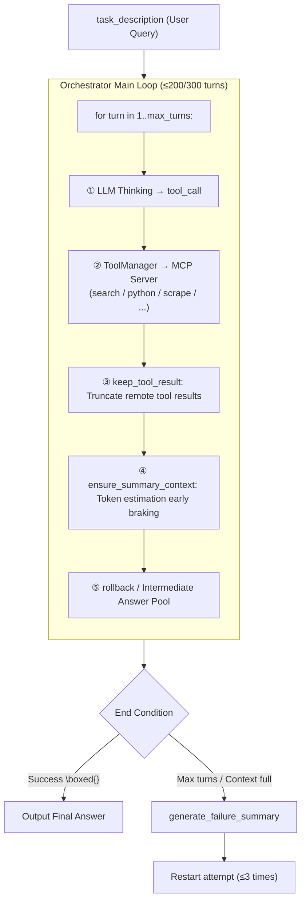

> MiroThinker 1.7 has achieved [SOTA results](https://github.com/MiroMindAI/MiroThinker) in the field of long-horizon question reasoning. These outstanding results stem from the combination of a powerful Model and a solid Harness. This article documents key engineering optimizations in its Harness implementation.

## Prerequisite Background

MiroThinker is a deep research Agent — given a complex question ("what are the titles of the cs papers on arxiv today"), it autonomously breaks down the task, searches, scrapes webpages, runs Python for verification, and finally outputs the `\boxed{answer}`. The foundation is classic ReAct: each turn involves LLM reasoning + tool calling, the results are written back to the history, looping 200~300 times until convergence.

Supporting a 256K context + up to 300 tool calls for a single task is a significant engineering challenge. The runtime generally looks like this:



The following sections will detail the three main parts: "Guardrail Mechanisms → Tool Layer → Context Processing".

## 1. Model Behavior Guardrails
MiroThinker implements various mechanisms to prevent model errors and hallucinations.

### 1.1 Rollback Mechanism
When the model's output in a given turn falls short of expectations, the system pretends this turn never happened and prompts the model to regenerate. The core idea is to ensure that a "failed step" consumes neither context window nor reasoning step budget.

The implementation is straightforward: discard the model's response from the previous turn and start the current turn over.

```python
message_history.pop()            # Discard the recent assistant message
turn_count -= 1                  # Revert the turn budget
consecutive_rollbacks += 1       # Increment the consecutive failures counter
```
> 📍 Source: [`orchestrator.py:210`](https://github.com/MiroMindAI/MiroThinker/blob/370f9836/apps/miroflow-agent/src/core/orchestrator.py#L210-L218)

#### Effects:
- **For the model:** The poor output never existed, preventing it from "polluting" the reasoning path during regeneration.
- **For the budget:** `max_turns=200` represents effective progress steps; rollbacks are not counted against it.
- **For infinite loop prevention:** The independent counters `total_attempts` (= max_turns + 200) and `consecutive_rollbacks` (≤ 5) continue to increment, safeguarding against infinite retries.

#### 4 Types of Rollback Triggers

| Trigger | Associated Function | Trigger Condition Details | Trigger Result |
| :--- | :--- | :--- | :--- |
| **1. MCP Tag Format Error** | [`_handle_response_format_issues`](https://github.com/MiroMindAI/MiroThinker/blob/370f9836/apps/miroflow-agent/src/core/orchestrator.py#L180) | The model should use structured `tool_call`, but instead outputs plain text tags like `<mcp:...>` (matching [`mcp_tags`](https://github.com/MiroMindAI/MiroThinker/blob/370f9836/apps/miroflow-agent/src/utils/prompt_utils.py#L69) keywords). | Rollback |
| **2. Refusal Keywords** | [`_handle_response_format_issues`](https://github.com/MiroMindAI/MiroThinker/blob/370f9836/apps/miroflow-agent/src/core/orchestrator.py#L180) | The model's output starts with refusal patterns like `"As an AI..."` or `"I cannot..."` (matching [`refusal_keywords`](https://github.com/MiroMindAI/MiroThinker/blob/370f9836/apps/miroflow-agent/src/utils/prompt_utils.py#L78)). | Rollback |
| **3. Duplicate Query Detection** | [`_check_duplicate_query`](https://github.com/MiroMindAI/MiroThinker/blob/370f9836/apps/miroflow-agent/src/core/orchestrator.py#L257) | The same agent uses the same tool to execute the exact same query (isolated cache based on `cache_name = agent_id + tool_name`).<br><br>**[Fingerprint extraction logic for tools](https://github.com/MiroMindAI/MiroThinker/blob/370f9836/apps/miroflow-agent/src/core/tool_executor.py#L102):**<br>• `google_search` → extracts `arguments["q"]`<br>• `scrape_website` → extracts `arguments["url"]`<br>• `scrape_and_extract_info` → extracts `url + info_to_extract` | Rollback, forcing the model to try a different approach |
| **4. Tool Execution Error** | [`should_rollback_result`](https://github.com/MiroMindAI/MiroThinker/blob/370f9836/apps/miroflow-agent/src/core/tool_executor.py#L240) | The tool returns a result matching any of the following:<br>1. `"Unknown tool: ..."`<br>2. `"Error executing tool ..."`<br>3. Google Search returns `organic: []` (empty results) | Rollback, prompting the model to re-plan |

### 1.2 Simple Error Correction
Hard guardrails are implemented by explicitly hardcoding "known model errors" into the system.

#### [`fix_tool_call_arguments`](https://github.com/MiroMindAI/MiroThinker/blob/370f9836/apps/miroflow-agent/src/core/tool_executor.py#L68) — Auto-correcting Common Parameter Errors

In [`tool_executor.py`](https://github.com/MiroMindAI/MiroThinker/blob/370f9836/apps/miroflow-agent/src/core/tool_executor.py), **automatic mapping and correction** is applied to common parameter naming mistakes made by the model.

**Typical Correction Scenarios:**
- **`scrape_and_extract_info`**: Automatically maps incorrect `description` or `introduction` keys to `info_to_extract`.
- **`run_python_code`**:
  - Maps `code` to `code_block`.
  - If `sandbox_id` is missing, injects `"default"` to trigger a stateless fallback execution.

#### [`INVALID_SANDBOX_IDS`](https://github.com/MiroMindAI/MiroThinker/blob/370f9836/libs/miroflow-tools/src/miroflow_tools/mcp_servers/python_mcp_server.py#L31) — Sandbox ID Hallucination Blacklist

Within [`python_mcp_server.py`](https://github.com/MiroMindAI/MiroThinker/blob/370f9836/libs/miroflow-tools/src/miroflow_tools/mcp_servers/python_mcp_server.py), a blacklist of 21 invalid IDs often "hallucinated" intuitively by models (such as `"default"`, `"sandbox"`, `"auto"`, etc.) is maintained.

When the blacklist is hit, the system responds with a **friendly error message** or automatically **downgrades to stateless execution**.

## 2. Tool Design
### 2.1 MCP Sub-process Isolation
Each tool operates as an independent FastMCP process, communicating with the main process via `stdio`. Advantages of this architecture include:
- **High Fault Tolerance:** The crash of a single tool does not interrupt the main loop.
- **Environment Isolation:** Tools can leverage any Python dependencies without contaminating the main program's environment.
- **Concurrency-Friendly:** Inherently supports concurrent multi-tool execution.

### 2.2 Fine-grained Tool Blacklisting (`tool_blacklist`)
The system supports granular tool disabling via a blacklist mechanism in the YAML configuration:
```yaml
tool_blacklist:
  - ["search_and_scrape_webpage", "sogou_search"]
  - ["tool-python", "download_file_from_sandbox_to_local"]
```

### 2.3 Unified Tool Abstraction for Sub-Agents ([`expose_sub_agents_as_tools`](https://github.com/MiroMindAI/MiroThinker/blob/370f9836/apps/miroflow-agent/src/config/settings.py#L383))
Sub-agents are not treated as special entities. Instead, they are directly registered into the main Agent's tool list with an `agent-` prefix. The main Agent invoking `agent-browsing(subtask=...)` is technically indistinguishable from calling a standard tool, achieving a system-wide unified abstraction.

## 3. Context Parameter Processing
### 3.1 Runtime Compression: [`_remove_tool_result_from_messages`](https://github.com/MiroMindAI/MiroThinker/blob/370f9836/apps/miroflow-agent/src/llm/base_client.py#L124)
This optimization is also noted in the original paper.
In standard ReAct, all tool outputs remain in the history, rapidly exhausting the context window. MiroThinker modifies this by retaining only the tool outputs from the most recent `K` turns, while strictly preserving all "thoughts" and "actions". This technique conserves context without losing the reasoning chain—a critical engineering trick that enables support for "hundreds of tool call steps."
While this might sacrifice some KV cache, it represents a worthwhile trade-off for scenarios producing exceptionally long tool outputs, such as web browsing.

```python
# Preserve the message structure but replace content
if isinstance(msg.get("content"), list):
    # For Anthropic format
    msg["content"] = [
        {
            "type": "text",
            "text": "Tool result is omitted to save tokens.",
        }
    ]
else:
    # For OpenAI format
    msg["content"] = "Tool result is omitted to save tokens."
```
> 📍 Source: [`base_client.py:202-218`](https://github.com/MiroMindAI/MiroThinker/blob/370f9836/apps/miroflow-agent/src/llm/base_client.py#L202-L218)

### 3.2 Early Braking: [`ensure_summary_context`](https://github.com/MiroMindAI/MiroThinker/blob/370f9836/apps/miroflow-agent/src/llm/providers/openai_client.py#L392)

Section 3.1 solves the problem of slow token accumulation in steady state, but a **single** tool result could instantly burst the limit—for example, a 50K token webpage body. `ensure_summary_context` performs a token estimation at the end of each turn, braking early if approaching the limit:

```python
estimated_total = (
    last_prompt_tokens + last_completion_tokens
    + last_user_tokens          # The newly inserted tool result
    + summary_tokens            # Reserved for final summary
    + max_tokens                # Reserved for response
    + 1000                      # buffer
)
if estimated_total >= max_context_length:   # 256K
    message_history.pop()       # Discard the newly added tool result
    message_history.pop()       # Discard the corresponding assistant tool_call
    return False                # Main loop sees False → break immediately
```

The token count is estimated using tiktoken and multiplied by 1.5 as a buffer, ensuring it's conservative rather than precise. Once it is determined to overflow, the main loop directly enters the final summary stage.

Division of labor with 3.1:
- **3.1**: Slowly saves tokens in steady state, performed on every call.
- **3.2**: Brakes instantly if a single result is too large, breaking out of the main loop.

### 3.3 Error Summary: [`generate_failure_summary`](https://github.com/MiroMindAI/MiroThinker/blob/370f9836/apps/miroflow-agent/src/core/answer_generator.py#L170)

Section 3.1 covers "mechanical truncation" within a single task. However, when a task exhausts `max_turns` or hits the context limit without producing an answer, a more radical compression is needed—forcing the model to condense the entire conversation into a concise failure summary.

This is achieved by appending a summary prompt to the end of the history and invoking the LLM to output a structured summary:

```python
failure_summary_history.append({"role": "user",      "content": FAILURE_SUMMARY_PROMPT})
failure_summary_history.append({"role": "assistant", "content": FAILURE_SUMMARY_ASSISTANT_PREFIX})
```
> 📍 Source: [`answer_generator.py:202-213`](https://github.com/MiroMindAI/MiroThinker/blob/370f9836/apps/miroflow-agent/src/core/answer_generator.py#L202-L213) | Prompt Templates: [`FAILURE_SUMMARY_PROMPT`](https://github.com/MiroMindAI/MiroThinker/blob/370f9836/apps/miroflow-agent/src/utils/prompt_utils.py#L44) / [`FAILURE_SUMMARY_ASSISTANT_PREFIX`](https://github.com/MiroMindAI/MiroThinker/blob/370f9836/apps/miroflow-agent/src/utils/prompt_utils.py#L61)

Summaries are strictly categorized into one of 4 types:
- **incomplete**: Ran out of steps before finishing.
- **blocked**: Persistently failed tool executions, causing a deadlock.
- **misdirected**: Proceeded down the wrong path.
- **format_missed**: Generated the correct answer but failed to format it properly.

#### Key Design: Summaries are not fed back into the current session, but trigger a task restart

The generated `failure_experience_summary` is not injected back into the ongoing dialogue. Instead, it is thrown back to the outer pipeline and appended to the `task_description` of the **next full task execution**:

```
Original Task + "Previous Failure Experience: [incomplete] Tried X, found Y, but got stuck at Z..."
```

The new attempt starts with a fresh 256K window but can see the pitfalls encountered in previous run(s) via the prompt. By default, it retries 3 times. On the final try, `is_final_retry=True` disables the "avoid guessing" logic, forcing a fallback answer.

This design ensures the reasoning chain isn't contaminated by "half-truncated compression"—it either runs entirely or restarts completely. It effectively sidesteps the common issue in rolling summaries where "the model hallucinates further based on its own fabricated summary."

### 3.4 Fallback Answer Pool: [`intermediate_boxed_answers`](https://github.com/MiroMindAI/MiroThinker/blob/370f9836/apps/miroflow-agent/src/core/orchestrator.py#L848-L852)

In every turn of the main loop, the system extracts `\boxed{...}` content from the LLM output and stores it in a list:

```python
boxed_content = output_formatter._extract_boxed_content(assistant_response_text)
if boxed_content:
    self.intermediate_boxed_answers.append(boxed_content)
```

If the task ultimately fails to produce a compliant answer, it falls back to the last intermediate answer as the fallback output.

However, there is a **condition**: when context management is enabled, the intermediate retries **do not** use this fallback. A false positive fallback would cause the pipeline to misjudge it as a success and stop triggering new attempts. It is only enabled during the final retry (`is_final_retry=True`).

This transforms "answer extraction" from a one-time event into a continuous process—the model might have guessed a part correctly at step 50, but then wandered off track later. The fallback pool ensures that such partial progress is not wasted.

### 3.5 Assistant Prefill: [`continue_final_message`](https://github.com/MiroMindAI/MiroThinker/blob/370f9836/apps/miroflow-agent/src/llm/providers/openai_client.py#L153-L155)

```python
  if messages_for_llm[-1].get("role") == "assistant":
      params["extra_body"]["continue_final_message"] = True
      params["extra_body"]["add_generation_prompt"] = False
```
> 📍 Source: [`openai_client.py:153-155`](https://github.com/MiroMindAI/MiroThinker/blob/370f9836/apps/miroflow-agent/src/llm/providers/openai_client.py#L153-L155)

When the last entry in `message_history` is an `assistant` message (for example, a pre-injected prefix during format correction), the LLM continues generating from that point instead of starting from scratch. This leverages the extended capabilities of vLLM/SGLang for fine-grained control.

An `assistant` message at the end of `message_history` occurs in several scenarios:

- **Scenario 1:** Guided failure summary generation.
- **Scenario 2:** Regeneration boundary after a rollback.
- **Scenario 3:** Truncation recovery.
  - When `finish_reason == "length"` triggers a retry with `max_tokens *= 1.1`, the previous assistant output was truncated. By preserving this truncated assistant message and setting `continue_final_message=True`, the model simply resumes generation from the truncation point, avoiding the need to regenerate the existing text.

## 4. Takeaways List

After walking through the source code, several engineering designs are worth adapting in your own Agent projects:

1. **Rollback ensuring failures don't consume budget (1.1)**
   Treating "pretend this turn never happened" as a first-class citizen is cleaner than forcibly injecting a retry prompt, and it makes the state machine easier to reason about.

2. **Runtime compression uses copies, while original history is preserved (3.1)**
   What is sent to the LLM is a truncated copy, but the TaskLog is always full. This saves money at runtime, while offline training / visualization get the full data. One piece of code feeds multiple downstreams.

3. **Failure summaries feed the next attempt, not the current session (3.3)**
   Avoids the issue of the "model hallucinating further based on its newly fabricated summary." It either runs fully or restarts completely, keeping the state machine clean.

4. **Continuous answer extraction (3.4)**
   Trying to extract `\boxed{}` in every turn rather than just at the end. The fallback pool ensures that progress isn't wasted if the model "guessed right halfway but took a wrong turn later."

5. **Hardcoding known model bugs (1.2)**
   Parameter name mapping, sandbox_id blacklists—rather than training the model to not make mistakes, it's better to provide a safety net at the engineering layer. These are targeted patches summarized from thousands of traces, not over-defensive programming.

6. **Using Sub-agents as tools (2.3)**
   Registering them in the tool list with an `agent-` prefix makes them indistinguishable from the main Agent's invocation method. A single abstraction unifies two execution models.
