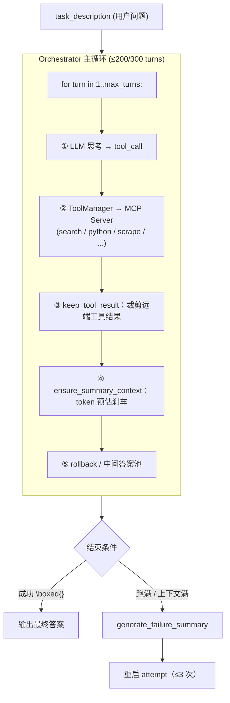

> MiroThinker 1.7 在长问题推理领域取得了[SOTA的成绩](https://github.com/MiroMindAI/MiroThinker)，优秀的成绩是由强Model与扎实的Harness共同组成的，本文是对其Harness实现中的关键工程优化的记录。

## 前置背景

MiroThinker 是一个深度研究型 Agent —— 给一个复杂问题（"今天 arxiv 上 cs 的论文标题是什么"），它会自己拆任务、搜索、抓网页、跑 Python 验证，最后输出 `\boxed{答案}`。底子是经典 ReAct：每回合 LLM 思考 + 工具调用，结果回写历史，循环 200~300 次直到收敛。

256K 上下文 + 单任务最多 300 次工具调用，对工程是不小挑战。运行时整体长这样：



下文按"护栏机制 → 工具层 → 上下文处理"三块展开。

## 1. 模型行为护栏
MiroThinker中实现了多种预防模型出错、幻觉的机制。
### 1.1 Rollback机制
当模型某一回合的输出不符合预期时，假装这一回合没发生过，让模型重新生成。它的核心思想是让“失败的一步”不消耗上下文与推理步数。  

具体的做法简单直接：把模型上一轮的回答扔掉，这一轮重新来过
```python
message_history.pop()            # 把模型刚刚的 assistant 消息扔掉
turn_count -= 1                  # turn 预算回退
consecutive_rollbacks += 1       # 连续失败计数 +1
```
> 📍 源码：[`orchestrator.py:210`](https://github.com/MiroMindAI/MiroThinker/blob/370f9836/apps/miroflow-agent/src/core/orchestrator.py#L210-L218)

#### 效果：
- 对模型而言：这次糟糕的输出从未存在，下次重新生成不会被它"污染"思路
- 对预算而言：max_turns=200 是有效推进次数；rollback 不计入
- 对死循环防护而言：total_attempts（= max_turns + 200）和 consecutive_rollbacks（≤5）这两个独立计数器仍在递增，防止无限重来

#### 4 类 Rollback 触发点

| 触发点 | 关联函数 | 触发条件详情 | 触发结果 |
| :--- | :--- | :--- | :--- |
| **1. MCP 标签格式错误** | [`_handle_response_format_issues`](https://github.com/MiroMindAI/MiroThinker/blob/370f9836/apps/miroflow-agent/src/core/orchestrator.py#L180) | 模型本该使用结构化 `tool_call`，但输出了 `<mcp:...>` 之类的纯文本标签（命中 [`mcp_tags`](https://github.com/MiroMindAI/MiroThinker/blob/370f9836/apps/miroflow-agent/src/utils/prompt_utils.py#L69) 关键字）。 | Rollback |
| **2. 拒答关键词** | [`_handle_response_format_issues`](https://github.com/MiroMindAI/MiroThinker/blob/370f9836/apps/miroflow-agent/src/core/orchestrator.py#L180) | 模型输出类似 `"As an AI..."`、`"I cannot..."` 的拒绝回答句式开头（命中 [`refusal_keywords`](https://github.com/MiroMindAI/MiroThinker/blob/370f9836/apps/miroflow-agent/src/utils/prompt_utils.py#L78)）。 | Rollback |
| **3. 重复查询检测** | [`_check_duplicate_query`](https://github.com/MiroMindAI/MiroThinker/blob/370f9836/apps/miroflow-agent/src/core/orchestrator.py#L257) | 同一个 agent 用同一个 tool 查询过同一个 query（按 `cache_name = agent_id + tool_name` 隔离的缓存）。<br><br>**[各工具单独的"指纹"提取逻辑](https://github.com/MiroMindAI/MiroThinker/blob/370f9836/apps/miroflow-agent/src/core/tool_executor.py#L102)：**<br>• `google_search` → 提取 `arguments["q"]`<br>• `scrape_website` → 提取 `arguments["url"]`<br>• `scrape_and_extract_info` → 提取 `url + info_to_extract` | Rollback，<br>逼模型换个角度 |
| **4. 工具结果错误** | [`should_rollback_result`](https://github.com/MiroMindAI/MiroThinker/blob/370f9836/apps/miroflow-agent/src/core/tool_executor.py#L240) | 工具返回值满足以下任一情况：<br>1. `"Unknown tool: ..."`<br>2. `"Error executing tool ..."`<br>3. Google 搜索返回 `organic: []`（空结果） | Rollback，<br>让模型重新规划 |

### 1.2 简易错误纠正
实现了“已知模型错误”明确写入代码的硬护栏

#### [`fix_tool_call_arguments`](https://github.com/MiroMindAI/MiroThinker/blob/370f9836/apps/miroflow-agent/src/core/tool_executor.py#L68) —— 自动纠正模型常犯的参数错误

在 [`tool_executor.py`](https://github.com/MiroMindAI/MiroThinker/blob/370f9836/apps/miroflow-agent/src/core/tool_executor.py) 中，针对模型常犯的参数命名错误进行了**自动映射纠正**。

**典型纠正场景：**
- **`scrape_and_extract_info`**：将错写的 `description` 或 `introduction` 自动转为 `info_to_extract`。
- **`run_python_code`**：
  - 将错写的 `code` 自动转为 `code_block`。
  - 若漏传 `sandbox_id`，自动填入 `"default"`，触发无状态（stateless）降级执行。

#### [`INVALID_SANDBOX_IDS`](https://github.com/MiroMindAI/MiroThinker/blob/370f9836/libs/miroflow-tools/src/miroflow_tools/mcp_servers/python_mcp_server.py#L31) —— Sandbox ID 幻觉黑名单

在 [`python_mcp_server.py`](https://github.com/MiroMindAI/MiroThinker/blob/370f9836/libs/miroflow-tools/src/miroflow_tools/mcp_servers/python_mcp_server.py) 中，梳理了 21 个模型常“凭直觉”瞎编的无效 ID（如 `"default"`, `"sandbox"`, `"auto"` 等）作为黑名单。

一旦命中该黑名单，系统会返回**友好报错**，或自动**降级到无状态（stateless）执行**。

## 2. 工具设计
### 2.1 MCP 子进程隔离
每个工具都是独立的 FastMCP 进程，主进程通过 `stdio` 与其通信。这样做的好处：
- **高容错性**：单个工具崩溃不会影响主循环运行。
- **环境隔离**：工具可以使用任意 Python 依赖，不会污染主程序的运行环境。
- **并发友好**：天然支持多工具并发执行。

### 2.2 Server 内细粒度屏蔽（`tool_blacklist`）
支持在 YAML 配置中对工具进行细粒度屏蔽（黑名单机制）：
```yaml
tool_blacklist:
  - ["search_and_scrape_webpage", "sogou_search"]
  - ["tool-python", "download_file_from_sandbox_to_local"]
```

### 2.3 Sub-Agent 统一工具抽象（[`expose_sub_agents_as_tools`](https://github.com/MiroMindAI/MiroThinker/blob/370f9836/apps/miroflow-agent/src/config/settings.py#L383)）
Sub-agent 在系统中并非一种特殊类型，而是以 `agent-` 作为名称前缀，直接注册到主 Agent 的工具列表中。主 Agent 调用 `agent-browsing(subtask=...)` 与调用普通工具毫无区别，实现了系统级的统一抽象。

## 3. 上下文参数处理
### 3.1 运行时压缩：[`_remove_tool_result_from_messages`](https://github.com/MiroMindAI/MiroThinker/blob/370f9836/apps/miroflow-agent/src/llm/base_client.py#L124)
这个优化点在论文中也有提及。
在标准 ReAct 里，所有工具输出都会保留在历史里，导致上下文很快被撑爆。MiroThinker 改成只保留最近 K 次工具的输出，但完整保留所有"思考"和"行动"记录。这样既省上下文，又不丢推理链条——这是它能支持"几百步工具调用"的关键工程技巧。  
这可能会丢一些KV cache，但对于浏览网页这种特别长的工具调用结果的场景，是一个值得的权衡。

```python
# Preserve the message structure but replace content
if isinstance(msg.get("content"), list):
    # For Anthropic format
    msg["content"] = [
        {
            "type": "text",
            "text": "Tool result is omitted to save tokens.",
        }
    ]
else:
    # For OpenAI format
    msg["content"] = "Tool result is omitted to save tokens."
```
> 📍 源码：[`base_client.py:202-218`](https://github.com/MiroMindAI/MiroThinker/blob/370f9836/apps/miroflow-agent/src/llm/base_client.py#L202-L218)

### 3.2 提前刹车：[`ensure_summary_context`](https://github.com/MiroMindAI/MiroThinker/blob/370f9836/apps/miroflow-agent/src/llm/providers/openai_client.py#L392)

3.1 解决稳态下 token 慢慢累积的问题，但**单条**工具结果就能瞬间撑爆——比如一篇 50K token 的网页正文。`ensure_summary_context` 在每回合末做一次 token 预估，逼近上限就提前刹车：

```python
estimated_total = (
    last_prompt_tokens + last_completion_tokens
    + last_user_tokens          # 新塞进去的工具结果
    + summary_tokens            # 给 final summary 留位置
    + max_tokens                # 给响应留位置
    + 1000                      # buffer
)
if estimated_total >= max_context_length:   # 256K
    message_history.pop()       # 弹掉刚加的工具结果
    message_history.pop()       # 弹掉对应的 assistant tool_call
    return False                # 主循环看到 False → 立即跳出
```

token 数用 tiktoken 估算并乘 1.5 当 buffer，保守而非精确。一旦判定要爆，主循环直接进入 final summary 阶段。

跟 3.1 的分工：
- **3.1**：稳态下慢慢省 token，每次调用都做
- **3.2**：单条结果太大就当场刹车，跳出主循环

### 3.3 错误总结：[`generate_failure_summary`](https://github.com/MiroMindAI/MiroThinker/blob/370f9836/apps/miroflow-agent/src/core/answer_generator.py#L170)

3.1 是单任务内的"机械裁剪"，但当任务跑满 `max_turns` 或上下文逼近上限仍没拿到答案时，就需要更彻底的压缩——让模型自己把整段对话浓缩成一段失败经验。

具体做法是：在历史末尾追加一个 summary prompt，调一次 LLM 让它输出结构化总结：

```python
failure_summary_history.append({"role": "user",      "content": FAILURE_SUMMARY_PROMPT})
failure_summary_history.append({"role": "assistant", "content": FAILURE_SUMMARY_ASSISTANT_PREFIX})
```
> 📍 源码：[`answer_generator.py:202-213`](https://github.com/MiroMindAI/MiroThinker/blob/370f9836/apps/miroflow-agent/src/core/answer_generator.py#L202-L213) ｜ Prompt 模板：[`FAILURE_SUMMARY_PROMPT`](https://github.com/MiroMindAI/MiroThinker/blob/370f9836/apps/miroflow-agent/src/utils/prompt_utils.py#L44) / [`FAILURE_SUMMARY_ASSISTANT_PREFIX`](https://github.com/MiroMindAI/MiroThinker/blob/370f9836/apps/miroflow-agent/src/utils/prompt_utils.py#L61)

总结被强制归到 4 类之一：
- **incomplete**：步数不够，没跑完
- **blocked**：工具一直失败，卡住了
- **misdirected**：方向走错了
- **format_missed**：答出来了但格式错

#### 关键设计：摘要不喂回当前会话，而是重启任务

生成的 `failure_experience_summary` 不会注入到当前对话让模型继续，而是被抛回 pipeline 外层，拼接到**下一次完整任务**的 `task_description` 后面：

```
原始任务 + "上次失败经验：[incomplete] 尝试了 X，找到了 Y，卡在 Z..."
```

新一次 attempt 拿到全新的 256K 窗口，但 prompt 里能看到上次（们）踩过的坑。默认重试 3 次，最后一次 `is_final_retry=True` 关闭"避免瞎猜"逻辑，强制走兜底答案。

这样设计的好处是 reasoning chain 不会被"半截压缩"污染——要么完整跑、要么完全重启，避免了滚动 summary 常见的"模型对自己编的摘要再二次脑补"问题。

### 3.4 兜底答案池：[`intermediate_boxed_answers`](https://github.com/MiroMindAI/MiroThinker/blob/370f9836/apps/miroflow-agent/src/core/orchestrator.py#L848-L852)

主循环每回合都会从 LLM 输出里抽 `\boxed{...}` 内容存进列表：

```python
boxed_content = output_formatter._extract_boxed_content(assistant_response_text)
if boxed_content:
    self.intermediate_boxed_answers.append(boxed_content)
```

任务最终如果没产出合规答案，就退回最后一个中间答案当兜底输出。

但**有条件**：启用 context management 时，中间几次重试**不**用兜底——错误兜底会让 pipeline 误判成功而不再触发新一次 attempt；只在最后一次重试 (`is_final_retry=True`) 才打开。

这把"答案提取"从一次性事件变成连续过程——模型在第 50 步可能就猜对了一部分，只是后面绕路绕错了，备胎池让这种部分进展不被浪费。

### 3.5 assistant prefill [`continue_final_message`](https://github.com/MiroMindAI/MiroThinker/blob/370f9836/apps/miroflow-agent/src/llm/providers/openai_client.py#L153-L155)

```python
  if messages_for_llm[-1].get("role") == "assistant":
      params["extra_body"]["continue_final_message"] = True
      params["extra_body"]["add_generation_prompt"] = False
```
> 📍 源码：[`openai_client.py:153-155`](https://github.com/MiroMindAI/MiroThinker/blob/370f9836/apps/miroflow-agent/src/llm/providers/openai_client.py#L153-L155)

当 message_history 末尾是 assistant 消息（比如格式纠错时塞了个开头），LLM 直接续写而不是从零开始。利用 vLLM/SGLang 的扩展能力做了精细控制。

message_history 末尾出现 assistant 消息有几个场景：

- 场景 1：Failure summary 引导
- 场景 2：Rollback 后的重生成边界
- 场景 3：截断恢复
    - finish_reason == "length" 触发 max_tokens *= 1.1 重试时 —— 上一次的 assistant 输出被截断了，下次调用如果保留这条 truncated assistant，加上continue_final_message=True，模型就能接着被截断的地方往下补完，不用重新生成前面已经写过的部分。

## 4. 可借鉴清单

跑过这一遍源码，几个工程设计值得在自己的 Agent 项目里借鉴：

1. **Rollback 让失败不消耗预算（1.1）**
   把"假装这一回合没发生"做成一等公民，比硬塞重试 prompt 更干净，状态机也更可推理。

2. **运行时压缩用副本，原始历史完整保留（3.1）**
   发给 LLM 的是裁剪过的副本，TaskLog 永远是全量。运行时省钱、离线训练 / 可视化拿全数据，一份代码喂多个下游。

3. **失败摘要喂下次 attempt，不喂回当前会话（3.3）**
   避免"模型对自己刚编的摘要二次脑补"。要么完整跑、要么完全重启，状态机干净。

4. **答案提取连续化（3.4）**
   每回合都试着抽 `\boxed{}` 而不只在最后做。备胎池让"中间猜对了但后面绕远了"的进展不被浪费。

5. **把已知模型 bug 硬编码（1.2）**
   参数名映射、sandbox_id 黑名单——与其训练模型不犯错，不如在工程层托底。这是从几千次 trace 里总结出的针对性补丁，不是过度防御。

6. **Sub-agent 当工具用（2.3）**
   用 `agent-` 前缀注册到工具列表，主 Agent 调用方式毫无差别。一个抽象统一两种执行模型。
