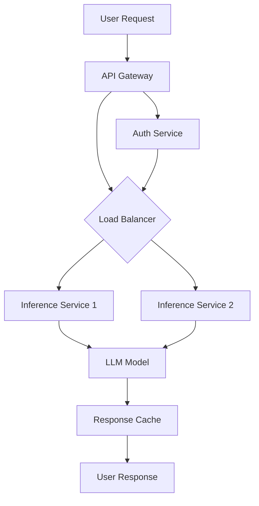

## Overview

This post demonstrates a typical AI system architecture using a Mermaid diagram.

## Key Components

- **API Gateway**: Entry point for all requests, handles rate limiting and routing.
- **Load Balancer**: Distributes traffic across inference services.
- **Inference Services**: Stateless workers that process model inference.
- **LLM Model**: The core large language model (e.g., a fine-tuned transformer).
- **Response Cache**: Caches repeated queries to reduce latency and cost.
- **Auth Service**: Validates tokens and enforces access control.

## Design Principles

1. **Horizontal scalability** - inference services scale independently.
2. **Fault tolerance** - multiple inference nodes prevent single points of failure.
3. **Caching** - reduces redundant compute for common prompts.
